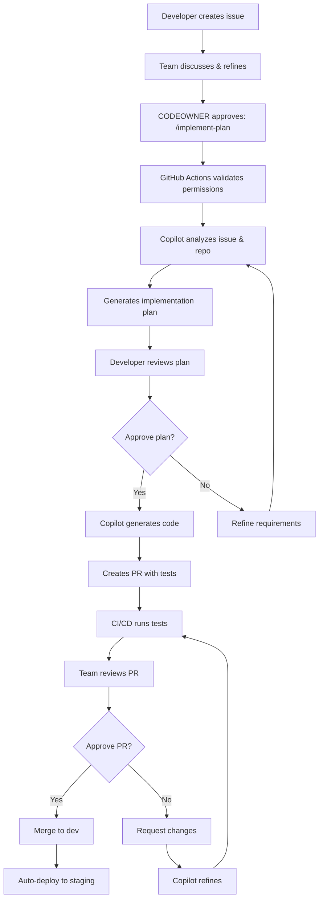

# 05 — GitHub Copilot Workspace Integration

> **Topic:** GitHub Copilot for Issue Assignment & PR Generation  
> **Difficulty:** Intermediate  
> **Prerequisites:** GitHub Copilot license, Repository access, Basic Git knowledge  
> **Related:** CI/CD Pipeline, Issue Management, Automated Code Generation

---

## Table of Contents

1. [What is GitHub Copilot Workspace?](#what-is-github-copilot-workspace)
2. [How It Works](#how-it-works)
3. [Benefits](#benefits)
4. [Workflow Overview](#workflow-overview)
5. [Step-by-Step Guide](#step-by-step-guide)
6. [Best Practices](#best-practices)
7. [Troubleshooting](#troubleshooting)
8. [Interview Questions](#interview-questions)

---

## What is GitHub Copilot Workspace?

**GitHub Copilot Workspace** is an AI-powered development environment that can:

1. **Read and understand GitHub issues** with full context (description, comments, related PRs)
2. **Generate implementation plans** based on repository structure and conventions
3. **Write production-ready code** following project patterns and best practices
4. **Create comprehensive tests** to validate the implementation
5. **Open pull requests** with detailed descriptions and testing evidence

### Key Capabilities

| Feature | Description |
|---------|-------------|
| 🎯 **Context-Aware** | Analyzes entire repository, issue history, and coding patterns |
| 🤖 **Autonomous Implementation** | Generates complete solutions including code, tests, and docs |
| 🔄 **Iterative Refinement** | Can revise based on feedback and CI failures |
| 📝 **Documentation** | Automatically updates READMEs and inline documentation |
| ✅ **Testing** | Creates unit tests, integration tests, and validates coverage |
| 🔒 **Security** | Follows security best practices and avoids vulnerabilities |

---

## How It Works

### Architecture Overview

```
┌─────────────────────────────────────────────────────────────┐
│                     GitHub Issue                            │
│  (Created by developer with problem statement)              │
└─────────────────────────────────────────────────────────────┘
                            ↓
┌─────────────────────────────────────────────────────────────┐
│               CODEOWNER Approval Trigger                    │
│  Comment: /implement-plan                                   │
│  (Validates permissions via CODEOWNERS file)                │
└─────────────────────────────────────────────────────────────┘
                            ↓
┌─────────────────────────────────────────────────────────────┐
│            GitHub Copilot Workspace Activated               │
│  1. Collects full issue context (description + comments)    │
│  2. Analyzes repository structure and patterns             │
│  3. Reads coding conventions and test requirements          │
│  4. Generates implementation plan                           │
└─────────────────────────────────────────────────────────────┘
                            ↓
┌─────────────────────────────────────────────────────────────┐
│                Developer Review & Approval                  │
│  Review the plan, suggest changes, approve execution        │
└─────────────────────────────────────────────────────────────┘
                            ↓
┌─────────────────────────────────────────────────────────────┐
│                    Code Generation                          │
│  Copilot writes code, tests, and documentation             │
│  - Creates new files                                        │
│  - Modifies existing files                                  │
│  - Writes comprehensive tests                               │
│  - Updates documentation                                    │
└─────────────────────────────────────────────────────────────┘
                            ↓
┌─────────────────────────────────────────────────────────────┐
│                 Pull Request Creation                       │
│  1. Creates branch (e.g., copilot/issue-123)              │
│  2. Commits all changes                                     │
│  3. Opens PR with detailed description                      │
│  4. Links to original issue                                 │
└─────────────────────────────────────────────────────────────┘
                            ↓
┌─────────────────────────────────────────────────────────────┐
│                   CI/CD Validation                          │
│  Automated tests run, code review requested                 │
└─────────────────────────────────────────────────────────────┘
```

### Key Components

1. **Issue Context Collection**: Gathers all relevant information from the issue
2. **Repository Analysis**: Understands project structure, patterns, and conventions
3. **Plan Generation**: Creates a detailed implementation plan for review
4. **Code Generation**: Writes production-ready code with tests
5. **PR Creation**: Opens a pull request with comprehensive documentation

---

## Benefits

### For Development Teams

✅ **Faster Delivery**
- Reduces implementation time by 40-60% for standard features
- Automates boilerplate code and test generation
- Handles repetitive tasks automatically

✅ **Consistent Quality**
- Follows established patterns and conventions
- Maintains consistent code style
- Generates comprehensive test coverage

✅ **Reduced Cognitive Load**
- Developers focus on reviewing vs. writing
- Less context switching between tasks
- Better work-life balance

✅ **Knowledge Preservation**
- Captures and applies team conventions automatically
- Onboards new team members faster
- Reduces dependency on specific individuals

### For Project Management

✅ **Predictable Timelines**
- More accurate effort estimates
- Reduced variance in delivery times
- Faster iteration cycles

✅ **Better Resource Allocation**
- Senior developers review instead of implement
- Junior developers learn from AI-generated code
- Team capacity increases without hiring

---

## Workflow Overview

### Standard Issue-to-PR Flow



---

## Step-by-Step Guide

### 1. Create a Well-Structured Issue

**Good Issue Example:**

```markdown
## Problem Statement
Users cannot reset their password when they forget it. This is a critical security feature.

## Current Behavior
- Login page has no "Forgot Password" link
- No password reset flow exists
- Users must contact support to reset passwords manually

## Expected Behavior
- Login page shows "Forgot Password" link
- Link opens password reset form
- Form validates email and sends reset link
- Reset link expires after 24 hours
- User can set new password via secure link

## Technical Context
- We use JWT for authentication (see common/auth.py)
- Email service is configured (uses SendGrid)
- User model exists in common/models/user.py

## Acceptance Criteria
- [ ] "Forgot Password" link on login page
- [ ] Password reset email sent within 1 minute
- [ ] Reset links expire after 24 hours
- [ ] Password complexity requirements enforced
- [ ] Success/error messages shown to user
- [ ] All flows covered by tests (>=75% coverage)

## Security Considerations
- Reset tokens must be cryptographically secure
- Email validation to prevent enumeration attacks
- Rate limiting to prevent abuse
- Audit logging for security events
```

**Why This is Good:**
- Clear problem statement
- Current vs expected behavior
- Technical context for Copilot
- Explicit acceptance criteria
- Security considerations highlighted

### 2. Team Discussion & Refinement

Add comments to clarify:
- Technical approach (if specific technology required)
- Edge cases to handle
- Related issues or PRs
- Design decisions already made

**Example Comment:**

```markdown
@team I think we should use time-based one-time passwords (TOTP) instead of email links for better security.

Pros:
- More secure (no link interception)
- Works offline after initial setup

Cons:
- Requires user to install authenticator app
- More complex UX

Thoughts?
```

### 3. CODEOWNER Approval

When ready to implement, a CODEOWNER triggers Copilot:

```bash
/implement-plan
```

**With Custom Parameters:**

```bash
# Custom branch name
/implement-plan branch=feature/password-reset

# Custom model (for large/complex tasks)
/implement-plan model=gpt-4.1

# Both parameters
/implement-plan branch=feature/password-reset model=gpt-4.1
```

### 4. GitHub Actions Validation

The workflow automatically:
1. ✅ Validates commenter is a CODEOWNER
2. ✅ Parses parameters (branch, model)
3. ✅ Collects all issue context and comments
4. ✅ Adds labels: `copilot-implementing`, `approved`
5. ✅ Posts implementation context for Copilot

### 5. Open in Copilot Workspace

**Option A: Automatic (if Copilot for Business enabled)**
- Copilot automatically activates on the issue

**Option B: Manual Trigger**
1. Navigate to the issue on GitHub
2. Click "Open in Copilot Workspace" button (top right)
3. Copilot loads issue context automatically

### 6. Review Implementation Plan

Copilot generates a detailed plan:

```
📋 Implementation Plan

Files to Create:
- projects/05_password_reset/src/reset_handler.py
- projects/05_password_reset/tests/test_reset_handler.py

Files to Modify:
- projects/auth/src/login.py (add forgot password link)
- projects/auth/templates/login.html (UI changes)

Key Changes:
1. Create password reset handler with token generation
2. Add email service integration for reset links
3. Update login page with forgot password UI
4. Add comprehensive tests (unit + integration)
5. Update documentation

Estimated Complexity: Medium
Estimated LOC: ~300 lines (including tests)
```

**Review Carefully:**
- Does the plan match your expectations?
- Are all acceptance criteria addressed?
- Are there any security concerns?

**Provide Feedback:**
- ✅ Approve if plan looks good
- 💬 Comment with changes if needed
- ❌ Reject and request new plan

### 7. Copilot Generates Code

Once approved, Copilot:
1. Creates new files
2. Modifies existing files
3. Writes comprehensive tests
4. Updates documentation
5. Runs linters and formatters

You can:
- ✅ Watch progress in real-time
- 💬 Provide feedback during generation
- 🔄 Request changes to specific files

### 8. Review Generated PR

Copilot creates a PR with:

```markdown
## Summary
Implements password reset functionality as specified in #123

## Changes
- ✅ Added password reset handler with secure token generation
- ✅ Integrated SendGrid for reset emails
- ✅ Updated login UI with "Forgot Password" link
- ✅ Added comprehensive test suite (82% coverage)
- ✅ Updated documentation

## Testing
All tests pass:
- Unit tests: 15/15 ✅
- Integration tests: 5/5 ✅
- Coverage: 82% (target: 75%)

## Security
- Reset tokens use cryptographically secure random generation
- Tokens expire after 24 hours
- Rate limiting prevents abuse (5 attempts per hour)
- Email validation prevents enumeration attacks
- All security events logged for audit

## Screenshots
[Screenshots of UI changes]

Closes #123
```

### 9. CI/CD Validation

GitHub Actions automatically:
1. Runs linters (flake8, black, mypy)
2. Runs test suite
3. Checks code coverage (>=75%)
4. Runs security scans
5. Reports results in PR

### 10. Code Review & Merge

**Reviewer Checklist:**
- [ ] Code follows repository conventions
- [ ] All acceptance criteria met
- [ ] Tests are comprehensive
- [ ] Security considerations addressed
- [ ] Documentation updated
- [ ] CI checks pass

**Merge Process:**
1. CODEOWNER approves PR
2. Merge to `dev` branch
3. Auto-deploy to staging
4. Validate on staging
5. Merge `dev` → `main` for production (manual approval required)

---

## Best Practices

### Writing Copilot-Friendly Issues

✅ **DO:**
- Write clear problem statements
- Include technical context
- Specify acceptance criteria
- Mention existing patterns to follow
- Highlight security considerations
- Link to related issues/PRs
- Include examples if applicable

❌ **DON'T:**
- Be vague ("make it better")
- Assume Copilot knows project history
- Skip acceptance criteria
- Ignore security implications
- Mix multiple unrelated features
- Use jargon without explanation

### Effective Comments

**Good Comment:**
```markdown
Please use the existing `EmailService` class in `common/services/email.py` 
instead of creating a new one. It already handles SendGrid integration and 
retry logic.
```

**Bad Comment:**
```markdown
Use email service
```

### Reviewing Copilot-Generated Code

**Focus on:**
1. **Logic Correctness**: Does it solve the problem?
2. **Security**: Are there vulnerabilities?
3. **Performance**: Any obvious bottlenecks?
4. **Maintainability**: Is it readable and well-structured?
5. **Test Coverage**: Are edge cases covered?

**Don't Nitpick:**
- Minor style differences (linters handle this)
- Naming if it follows conventions
- Comment style if consistent with codebase

### When to Refine vs. Merge

**Refine if:**
- Logic errors or bugs
- Security vulnerabilities
- Missing critical test cases
- Doesn't follow project conventions
- Performance issues

**Merge if:**
- Minor style preferences
- Comments could be better
- Tests are good enough (>=75% coverage)
- Follows conventions mostly

Remember: Perfect is the enemy of good. Copilot code is meant to be "good enough," not perfect.

---

## Troubleshooting

### Issue: "Open in Copilot Workspace" Button Missing

**Causes:**
- No GitHub Copilot license
- Repository not enabled for Copilot
- Issue already assigned to someone

**Solutions:**
1. Verify GitHub Copilot subscription
2. Check repository settings → GitHub Copilot
3. Unassign issue if already assigned

### Issue: Copilot Doesn't Understand Context

**Causes:**
- Issue description too vague
- Missing technical context
- Referenced code not accessible

**Solutions:**
1. Add more details to issue description
2. Include code snippets or file paths
3. Link to related PRs or documentation
4. Add clarifying comments

### Issue: Generated Code Doesn't Follow Conventions

**Causes:**
- Conventions not documented
- Conflicting patterns in codebase
- First time using Copilot on repo

**Solutions:**
1. Add `copilot-instructions.md` to `.github/` directory
2. Document coding standards clearly
3. Provide examples in issue comments
4. Use consistent patterns across codebase

### Issue: Copilot Creates Too Many/Few Files

**Causes:**
- Issue scope unclear
- Existing files not mentioned
- Project structure not obvious

**Solutions:**
1. Specify which files to modify in issue
2. Mention existing modules to reuse
3. Clarify scope: "modify existing" vs "create new"

### Issue: Tests Don't Cover Edge Cases

**Causes:**
- Edge cases not mentioned in issue
- Acceptance criteria incomplete

**Solutions:**
1. Add edge cases to issue description
2. Comment on PR requesting additional tests
3. Copilot can refine and add more tests

### Issue: Permission Denied on /implement-plan

**Causes:**
- Not a CODEOWNER
- CODEOWNERS file missing/misconfigured

**Solutions:**
1. Check `/CODEOWNERS` file in repo root
2. Ask CODEOWNER to trigger
3. Add yourself to CODEOWNERS if appropriate

---

## Interview Questions

### Q1: What is GitHub Copilot Workspace and how does it differ from GitHub Copilot in IDE?

**Answer:**

GitHub Copilot in IDE provides **inline code suggestions** as you type, helping with:
- Function completion
- Test generation
- Boilerplate code

GitHub Copilot Workspace provides **end-to-end implementation** from issue to PR:
- Reads entire issue context
- Analyzes repository structure
- Generates complete implementation plan
- Creates all necessary files
- Writes comprehensive tests
- Opens pull request

**Key Difference:** IDE Copilot is a **coding assistant** (helps you write code), Workspace is an **autonomous developer** (writes entire features).

### Q2: How does GitHub Copilot ensure generated code follows project conventions?

**Answer:**

Copilot uses multiple sources:

1. **Repository Analysis**: Scans existing code for patterns
2. **Copilot Instructions**: Reads `.github/copilot-instructions.md`
3. **Issue Context**: Applies guidance from issue comments
4. **Common Patterns**: Identifies frequently used libraries/frameworks
5. **Linter Configs**: Respects `.eslintrc`, `.flake8`, etc.

**Best Practice:** Create `copilot-instructions.md` with:
```markdown
# Coding Conventions
- Use common/ package for LLM initialization
- Follow LCEL pattern for chain composition
- Maintain 75%+ test coverage
- Use LangGraph for new agents
```

### Q3: What security considerations should you address when using Copilot Workspace?

**Answer:**

1. **Secrets Management**
   - Never include API keys in issues
   - Use environment variables
   - Reference existing config patterns

2. **Input Validation**
   - Explicitly request validation in issues
   - Mention attack vectors to prevent
   - Request security tests

3. **Dependency Security**
   - Specify approved libraries
   - Request vulnerability scanning
   - Mention security constraints

4. **Code Review**
   - Always review generated code
   - Check for SQL injection, XSS, etc.
   - Verify authentication/authorization

5. **Audit Logging**
   - Track what Copilot generates
   - Monitor for suspicious patterns
   - Keep PR history for compliance

### Q4: How do you handle cases where Copilot-generated code needs significant changes?

**Answer:**

**Option 1: Request Refinement (Recommended)**
1. Comment on PR with specific changes needed
2. Copilot can regenerate based on feedback
3. Faster than manual editing

**Option 2: Manual Fixes (Small Changes)**
1. Pull branch locally
2. Make targeted changes
3. Push and update PR

**Option 3: Reject & Refine Issue (Major Problems)**
1. Close PR
2. Update issue with clarifications
3. Trigger `/implement-plan` again with better context

**Best Practice:** Try refinement first. If Copilot can't address feedback after 2-3 iterations, fall back to manual fixes.

### Q5: How do you measure ROI of GitHub Copilot Workspace?

**Answer:**

**Quantitative Metrics:**

1. **Time Savings**
   - Avg implementation time: Before vs After
   - Time from issue creation to PR merge
   - Developer hours saved per sprint

2. **Quality Improvements**
   - Test coverage (before vs after)
   - Bug rate in Copilot-generated code
   - Code review iteration count

3. **Productivity**
   - Issues closed per sprint
   - PRs merged per developer
   - Backlog velocity

**Qualitative Metrics:**

1. **Developer Satisfaction**
   - Survey: "Do you prefer reviewing vs writing?"
   - Work-life balance improvements
   - Reduced burnout

2. **Code Consistency**
   - Pattern adherence
   - Style consistency
   - Convention violations

**Example Calculation:**
```
Assumptions:
- Developer hourly cost: $75/hr
- Average feature: 8 hours without Copilot
- Average feature: 3 hours with Copilot (1hr review vs 2hr Copilot work)
- Team: 5 developers
- Features per sprint: 20

Savings per sprint:
20 features × 5 hours saved × $75/hr = $7,500/sprint

Annual savings:
$7,500 × 26 sprints = $195,000/year

ROI:
Copilot cost: ~$20,000/year (5 developers)
Net benefit: $175,000/year
ROI: 875%
```

### Q6: What are the limitations of GitHub Copilot Workspace?

**Answer:**

1. **Complex Architectural Decisions**
   - Copilot implements plans, doesn't design architecture
   - Still need human architects for system design
   - Best for well-defined problems

2. **Domain-Specific Knowledge**
   - May miss industry-specific nuances
   - Requires explicit guidance in issues
   - Not a substitute for domain experts

3. **Multi-Repository Changes**
   - Works on single repo at a time
   - Can't coordinate changes across microservices
   - Requires manual orchestration

4. **Long-Term Refactoring**
   - Tactical changes only
   - Strategic refactoring needs human oversight
   - May not see big picture

5. **Creative Problem Solving**
   - Implements known patterns well
   - Novel solutions require human creativity
   - Best for "known" problem types

**Best Used For:**
- Standard CRUD features
- Bug fixes with clear reproduction steps
- Test generation
- Documentation updates
- Refactoring within single module

**Not Ideal For:**
- System architecture design
- Algorithm optimization
- Complex debugging (unknown root cause)
- Strategic technical decisions
- Breaking API changes across services

---

## Summary

GitHub Copilot Workspace transforms how teams implement features:

✅ **Faster**: 40-60% time savings on implementation  
✅ **Consistent**: Follows project conventions automatically  
✅ **Tested**: Generates comprehensive test suites  
✅ **Documented**: Updates docs as code changes  

**Key Success Factors:**
1. Write detailed, well-structured issues
2. Document coding conventions clearly
3. Provide context in comments
4. Review generated code thoroughly
5. Iterate based on CI feedback

**Remember:** Copilot is a tool to amplify developer productivity, not replace developers. It excels at implementation but still needs human oversight for architecture, design, and complex problem-solving.

---

## Additional Resources

### Official Documentation
- [GitHub Copilot Documentation](https://docs.github.com/en/copilot)
- [Assigning Issues to Copilot](https://docs.github.com/en/copilot/how-tos/use-copilot-agents/cloud-agent/start-copilot-sessions)
- [Assigning and Completing Issues with Coding Agent](https://github.blog/ai-and-ml/github-copilot/assigning-and-completing-issues-with-coding-agent-in-github-copilot/)

### Repository Guides
- [CI/CD Quick Reference](../docs/ci-cd-quickref.md)
- [CI/CD Full Documentation](../docs/ci-cd.md)
- [Contributing Guide](../docs/contributing.md)
- [Testing Strategy](../docs/TESTING_STRATEGY.md)

### Workflow Files
- [`.github/workflows/copilot-implement.yml`](../.github/workflows/copilot-implement.yml)
- [`.github/copilot-instructions.md`](../.github/copilot-instructions.md)
- [`/CODEOWNERS`](../CODEOWNERS)

---

*Last Updated: 2026-05-21*  
*Version: 1.0*
