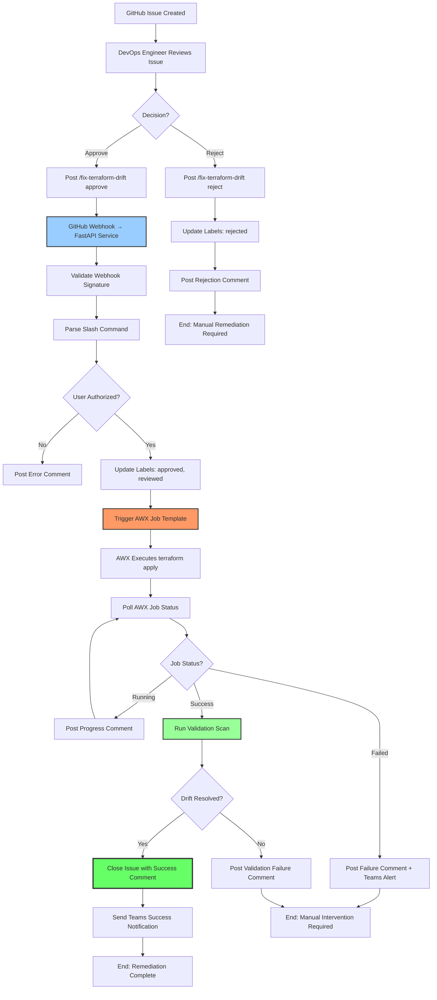
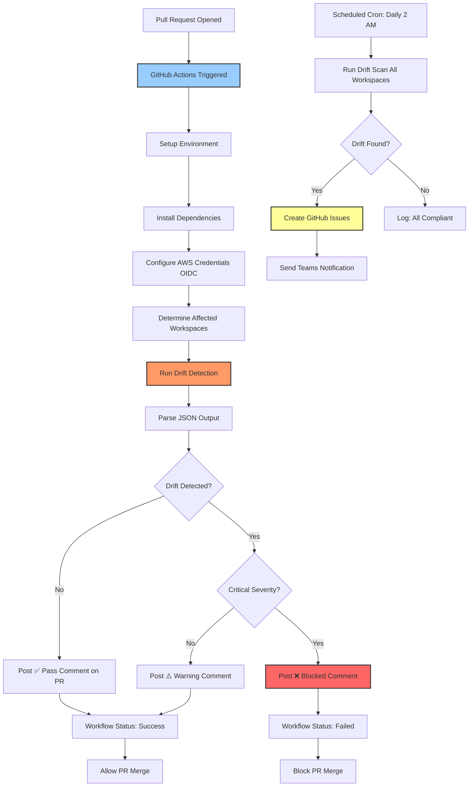
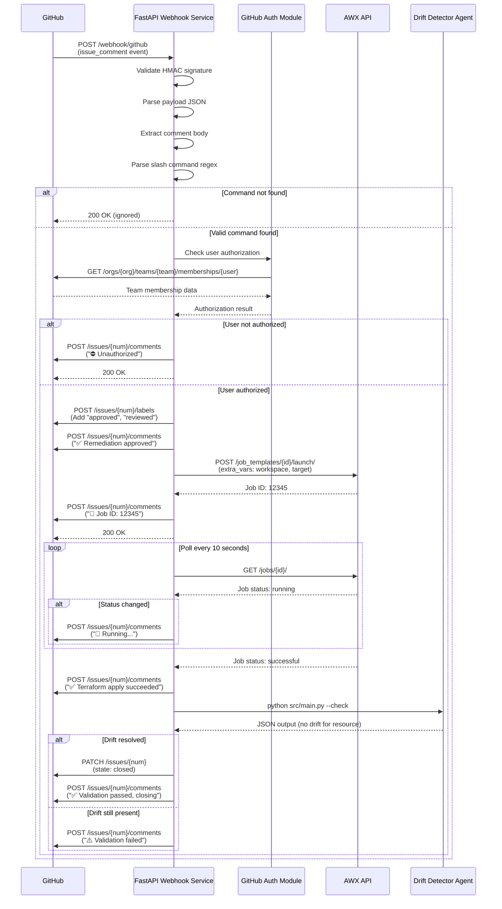
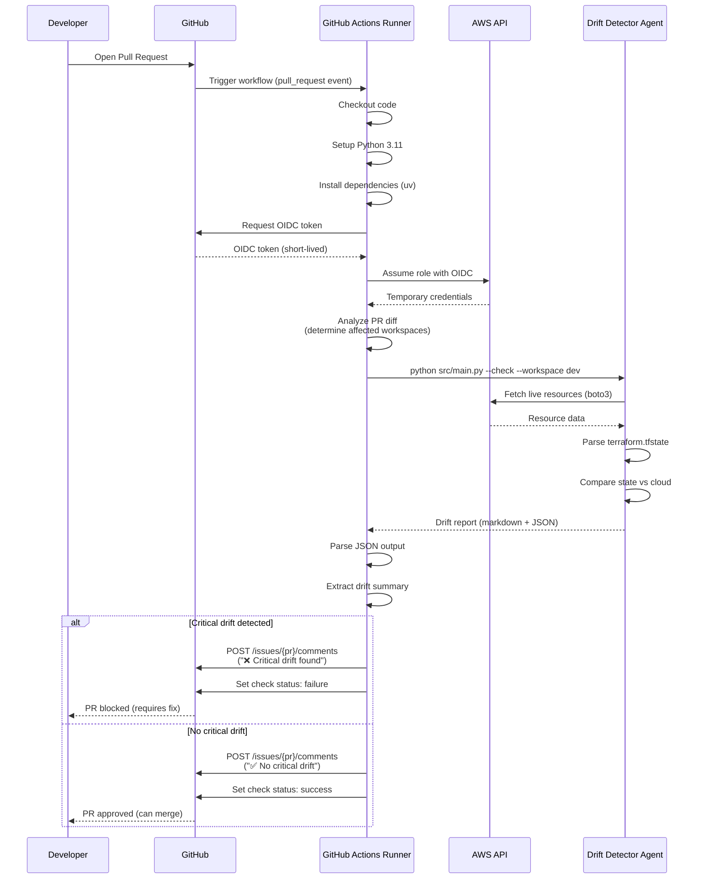

# 04 — Terraform Drift Detector: Automated Remediation & CI/CD (Phase 3 & 4)

> **Difficulty:** Advanced  
> **Pattern:** Event-driven automation with webhook handlers, AWX integration, CI/CD pipelines  
> **Components:** FastAPI, GitHub Webhooks, AWX REST API, GitHub Actions, pytest  
> **Prerequisites:** Completed Phase 1 (GitHub Integration) and Phase 2 (Teams Notifications)

---

## Table of Contents

1. [Use Case Description / Scenario](#1-use-case-description--scenario)
2. [Objective](#2-objective)
3. [Recommended Approach](#3-recommended-approach)
4. [Security Considerations](#4-security-considerations)
5. [Step-by-Step Thought Process](#5-step-by-step-thought-process)
6. [Pseudo Code](#6-pseudo-code)
7. [High Level Workflow Diagram](#7-high-level-workflow-diagram)
8. [Low Level Workflow Diagram](#8-low-level-workflow-diagram)
9. [Implementation Steps](#9-implementation-steps)
10. [Code Snippets](#10-code-snippets)
11. [Test Cases](#11-test-cases)
12. [Expected Outcomes](#12-expected-outcomes)

---

## 1. Use Case Description / Scenario

### Current State (Phase 1 & 2 Completed)

The Terraform Drift Detector currently:
- ✅ Detects drift between Terraform state and live AWS resources
- ✅ Creates GitHub issues with drift details and policy violations
- ✅ Sends Microsoft Teams notifications with adaptive cards
- ✅ Assigns issues to teams based on resource ownership patterns (teams.yaml)

### Problem Statement

After Phase 1 & 2 implementation, the remediation workflow still requires **manual intervention**:

1. 🚨 Agent detects drift → Creates GitHub issue
2. 📧 Teams notification sent → DevOps team notified
3. 👤 **Manual step:** Engineer reviews issue, decides to remediate
4. 💻 **Manual step:** Engineer runs `terraform apply -target=...` locally
5. ✅ **Manual step:** Engineer validates remediation and closes issue

**This creates operational bottlenecks:**
- **Response delays:** Manual terraform apply can take hours/days depending on team availability
- **Context switching:** Engineers must stop current work to handle drift alerts
- **Risk of errors:** Manual terraform commands prone to typos, wrong workspace, wrong state file
- **No audit trail:** Manual commands executed outside CI/CD leave no automated validation record
- **Scalability issues:** Large infrastructure (100+ resources) generates too many issues for manual remediation

### Desired Future State (Phase 3 & 4)

**Phase 3: Automated Remediation**
- DevOps engineer reviews GitHub issue, posts slash command: `/fix-terraform-drift approve`
- GitHub webhook triggers FastAPI service → Validates command → Calls AWX API
- AWX executes terraform apply job → Updates GitHub issue with job status
- Agent re-runs drift detection → Validates remediation successful → Closes issue
- Failure scenarios post diagnostic comments and alert on Teams

**Phase 4: Testing & CI/CD**
- Comprehensive test coverage for webhook handlers and AWX integration
- GitHub Actions workflow runs drift detection on every PR
- Automated PR comments with drift summary before merge
- Nightly scheduled drift scans for all environments

**Example workflow:**

```markdown
## GitHub Issue #42: 🚨 Drift: aws_instance.web-prod-01 - Tags Modified

**Comment by @devops-engineer:**
> /fix-terraform-drift approve

**[Bot Comment - 2 seconds later]:**
> ✅ Remediation approved. Triggering AWX job template...
> 🔄 Job ID: 12345 | Status: Running | [View in AWX](https://awx.example.com/jobs/12345)

**[Bot Comment - 45 seconds later]:**
> ✅ Terraform apply completed successfully
> 📋 Job summary: 1 resource modified, 0 added, 0 deleted
> 🔍 Running validation scan...

**[Bot Comment - 1 minute later]:**
> ✅ Validation passed: Drift resolved for resource i-0123456789abcdef0
> 🎉 Closing issue as remediation successful
```

---

## 2. Objective

### Phase 3: Automated Remediation

Build a **GitHub webhook listener + AWX automation system** that:

1. **Slash Command Parsing:** Monitor GitHub issue comments for `/fix-terraform-drift [approve|reject]` commands
2. **Access Control:** Validate commenter has required GitHub team membership or repository role
3. **Label Management:** Update issue labels (`approved`, `remediation-in-progress`, `reviewed`) based on command
4. **AWX Integration:** Trigger AWX job templates for terraform apply with correct workspace/resource targeting
5. **Status Tracking:** Update GitHub issue with real-time AWX job status (queued → running → success/failure)
6. **Validation Loop:** Re-run drift detection after terraform apply to confirm drift resolved
7. **Auto-closure:** Close GitHub issue automatically if validation passes
8. **Failure Handling:** Post diagnostic comments on failures, send Teams alert, require manual intervention

**Inputs:**
- GitHub webhook payloads (issue_comment events)
- AWX API credentials (from `.env` or Vault)
- Terraform workspace/resource mapping (from GitHub issue body)

**Outputs:**
- GitHub issue comments with job status updates
- Updated issue labels
- AWX job execution (terraform apply)
- Teams notifications on success/failure
- Closed issues (on successful remediation)

**Success Criteria:**
- Slash commands processed within 5 seconds
- AWX job triggered with correct parameters (workspace, target resource)
- GitHub issue updated in real-time with job progress
- Validation scan confirms drift resolved before auto-closing
- Unauthorized users receive error message (no remediation triggered)

### Phase 4: Testing & CI/CD

Build a **comprehensive test suite + CI/CD pipeline** that:

1. **Unit Tests:** Cover all new modules (webhook handlers, AWX client, validation logic) with >= 75% coverage
2. **Integration Tests:** Test webhook → AWX → validation flow end-to-end with mocked services
3. **GitHub Actions Workflow:** Run drift detection on every PR targeting main/dev branches
4. **PR Comments:** Automated bot comments on PRs with drift summary before merge
5. **Scheduled Scans:** Nightly cron job runs drift detection for all environments (prod, staging, dev)
6. **Failure Notifications:** Failed scans trigger Teams alerts with drift summary

**Inputs:**
- GitHub PR events (pull_request, pull_request_review)
- Scheduled cron triggers (daily at 2 AM UTC)
- Terraform state files from S3/Terraform Cloud (optional enhancement)

**Outputs:**
- pytest coverage reports (>= 75%)
- GitHub PR comments with drift analysis
- GitHub Actions workflow status (pass/fail)
- Teams notifications on scheduled scan failures

**Success Criteria:**
- All tests pass with >= 75% coverage
- PRs blocked if they would introduce critical drift
- Scheduled scans detect drift within 24 hours of occurrence
- Zero false positives in PR checks

---

## 3. Recommended Approach

### Phase 3 Architecture: Event-Driven with FastAPI + AWX

**Why FastAPI for webhook listener:**
- Async support for handling concurrent webhook events
- Built-in request validation with Pydantic models
- Easy deployment (Docker container, K8s, Cloud Run)
- OpenAPI docs for webhook payload testing

**Why AWX for terraform execution:**
- Centralized job execution with audit logs
- RBAC for controlling who can run terraform apply
- Inventory management for multiple AWS accounts
- Job templates with pre-configured credentials
- Real-time job status API for progress tracking

**Alternative considered: GitHub Actions for terraform apply**
- ❌ Pros: Native GitHub integration, no separate service
- ❌ Cons: Harder to track job status in real-time, less granular RBAC, no centralized audit

**Architecture Components:**

```
GitHub Issue Comment → GitHub Webhook → FastAPI Service → AWX API → Terraform Apply → Validation Agent → GitHub Issue Update
                                             ↓
                                      Authentication
                                      Rate Limiting
                                      Command Parsing
```

### Phase 4 Architecture: GitHub Actions + pytest

**GitHub Actions Workflow Triggers:**
1. **PR Check:** On `pull_request` to main/dev → Run drift detection on affected workspaces
2. **Scheduled Scan:** Cron `0 2 * * *` (daily 2 AM UTC) → Scan all environments
3. **Manual Dispatch:** `workflow_dispatch` → On-demand drift scans

**Test Strategy:**
- **Unit tests:** Mock all external APIs (GitHub, AWX, AWS)
- **Integration tests:** Use `responses` library to mock HTTP requests, test webhook flow end-to-end
- **Contract tests:** Validate webhook payload schemas match GitHub API spec
- **Load tests:** Simulate 50 concurrent webhook events (optional, for production readiness)

---

## 4. Security Considerations

### Phase 3: Webhook Security

1. **Webhook Secret Validation:**
   - GitHub webhooks include `X-Hub-Signature-256` header with HMAC signature
   - FastAPI must validate signature before processing payload (prevents spoofing)
   - Store webhook secret in Vault or GitHub Secrets, never commit to repo

2. **Access Control:**
   - Only GitHub users with specific team membership can trigger remediation
   - Validate commenter's role using GitHub API: `/orgs/{org}/teams/{team}/memberships/{username}`
   - Authorized teams: `@infrastructure-team`, `@sre-team`, `@devops-admins`
   - Unauthorized users receive error comment: "⛔ You don't have permission to approve remediation"

3. **Command Injection Prevention:**
   - Parse slash commands with strict regex: `^/fix-terraform-drift (approve|reject)$`
   - Never pass raw user input to shell commands
   - AWX job parameters validated against whitelist (workspace names, resource IDs from original issue)

4. **Rate Limiting:**
   - Limit webhook requests to 100/minute per repository (prevents abuse)
   - Queue remediation jobs if multiple triggered simultaneously (AWX job template concurrency)

5. **AWX Credentials:**
   - Store AWX API token in Vault with automatic rotation
   - Use least-privilege AWX user with execute-only permissions on terraform job templates
   - No read/write access to AWX credentials or inventory

6. **Terraform State Security:**
   - AWX job templates use S3 backend with encrypted state files
   - No direct state file access from webhook service
   - Terraform output redacted from GitHub comments (sensitive values masked)

### Phase 4: CI/CD Security

1. **GitHub Actions Secrets:**
   - Store AWS credentials in GitHub Secrets (not in workflow YAML)
   - Use OIDC for short-lived AWS credentials (no long-lived access keys)
   - Restrict secrets access to specific workflows with `environment` protection rules

2. **PR Permissions:**
   - Workflows triggered by PRs from forks run with read-only permissions
   - No automatic terraform apply on PRs (only drift detection + comment)
   - Require manual approval from codeowners before remediation workflows

3. **Audit Logging:**
   - All GitHub Actions runs logged with triggering user, timestamp, resources scanned
   - Failed scans logged to CloudWatch/Datadog for monitoring
   - Terraform apply commands logged in AWX with full context

---

## 5. Step-by-Step Thought Process

### Phase 3: Automated Remediation Implementation Flow

#### Step 1: Setup FastAPI Webhook Listener

**Goal:** Create HTTP endpoint to receive GitHub webhook payloads

**Reasoning:**
- FastAPI async support handles concurrent webhook events efficiently
- Pydantic models validate webhook payload structure (fail fast on malformed data)
- Separate concerns: webhook receiver (FastAPI) vs. business logic (handler functions)

**Implementation approach:**
```python
# src/webhook/server.py
from fastapi import FastAPI, Request, HTTPException
from .validator import validate_webhook_signature
from .handler import handle_issue_comment

app = FastAPI()

@app.post("/webhook/github")
async def github_webhook(request: Request):
    # 1. Validate webhook signature
    signature = request.headers.get("X-Hub-Signature-256")
    body = await request.body()
    if not validate_webhook_signature(body, signature):
        raise HTTPException(401, "Invalid signature")
    
    # 2. Parse JSON payload
    payload = await request.json()
    
    # 3. Route to handler based on event type
    event = request.headers.get("X-GitHub-Event")
    if event == "issue_comment":
        return await handle_issue_comment(payload)
    
    return {"status": "ignored"}
```

#### Step 2: Parse Slash Commands

**Goal:** Extract command intent (`approve` or `reject`) and validate format

**Reasoning:**
- Strict regex prevents command injection (no arbitrary code execution)
- Early validation fails fast (don't trigger AWX jobs for malformed commands)
- Case-insensitive matching handles user typos

**Implementation approach:**
```python
# src/webhook/command_parser.py
import re
from typing import Optional, Literal

COMMAND_REGEX = r'^/fix-terraform-drift\s+(approve|reject)(?:\s+(.+))?$'

def parse_command(comment_body: str) -> Optional[dict]:
    """
    Parse slash command from GitHub issue comment.
    
    Returns:
        {
            "action": "approve" | "reject",
            "reason": Optional[str]  # For reject commands
        }
        or None if not a valid command
    """
    match = re.search(COMMAND_REGEX, comment_body.strip(), re.IGNORECASE)
    if not match:
        return None
    
    action = match.group(1).lower()
    reason = match.group(2) if match.lastindex >= 2 else None
    
    return {"action": action, "reason": reason}
```

#### Step 3: Validate User Permissions

**Goal:** Check if comment author has permission to trigger remediation

**Reasoning:**
- Prevents unauthorized users from triggering production terraform apply
- GitHub API provides authoritative team membership data (no reliance on comment metadata)
- Fail with clear error message (helps legitimate users request access)

**Implementation approach:**
```python
# src/integrations/github_auth.py
import requests
from common.utils import require_env, get_logger

logger = get_logger(__name__)

AUTHORIZED_TEAMS = ["infrastructure-team", "sre-team", "devops-admins"]

def is_user_authorized(username: str, org: str, token: str) -> bool:
    """
    Check if GitHub user belongs to authorized teams.
    
    Args:
        username: GitHub username (from comment author)
        org: GitHub organization name
        token: GitHub API token
    
    Returns:
        True if user is in any authorized team, False otherwise
    """
    for team in AUTHORIZED_TEAMS:
        url = f"https://api.github.com/orgs/{org}/teams/{team}/memberships/{username}"
        resp = requests.get(
            url,
            headers={"Authorization": f"Bearer {token}"},
            timeout=10
        )
        
        if resp.status_code == 200:
            data = resp.json()
            if data.get("state") == "active":
                logger.info(f"User {username} authorized via team {team}")
                return True
    
    logger.warning(f"User {username} not authorized (not in any of: {AUTHORIZED_TEAMS})")
    return False
```

#### Step 4: Update Issue Labels

**Goal:** Mark issue with labels indicating remediation status

**Reasoning:**
- Visual feedback in GitHub UI (issue cards show labels)
- Enables filtering issues by status (e.g., "show me all approved issues")
- Provides audit trail (label timeline in issue events)

**Label lifecycle:**
```
Initial: [infrastructure-drift, severity-critical]
    ↓ /fix-terraform-drift approve
[infrastructure-drift, severity-critical, reviewed, approved]
    ↓ AWX job triggered
[infrastructure-drift, severity-critical, approved, remediation-in-progress]
    ↓ terraform apply succeeds
[infrastructure-drift, severity-critical, approved, remediation-complete]
    ↓ validation passes
[infrastructure-drift, severity-critical, approved, resolved] → Issue closed
```

#### Step 5: Trigger AWX Job Template

**Goal:** Execute terraform apply via AWX REST API with correct parameters

**Reasoning:**
- AWX provides centralized terraform execution with audit logs
- Job templates encapsulate terraform workspace, state backend, AWS credentials
- Extra vars pass resource targeting (`-target=aws_instance.web-prod-01`)

**Implementation approach:**
```python
# src/integrations/awx_client.py
import requests
from common.utils import get_logger

logger = get_logger(__name__)

class AWXClient:
    def __init__(self, base_url: str, token: str):
        self.base_url = base_url
        self.headers = {
            "Authorization": f"Bearer {token}",
            "Content-Type": "application/json"
        }
    
    def launch_terraform_job(
        self,
        template_id: int,
        workspace: str,
        target_resource: str,
        issue_url: str
    ) -> dict:
        """
        Launch terraform apply job template.
        
        Args:
            template_id: AWX job template ID (from config)
            workspace: Terraform workspace name
            target_resource: Resource address (e.g., "aws_instance.web-prod-01")
            issue_url: GitHub issue URL (for job metadata)
        
        Returns:
            {"job_id": 12345, "status": "pending"}
        """
        url = f"{self.base_url}/api/v2/job_templates/{template_id}/launch/"
        
        # Extra vars passed to terraform job
        extra_vars = {
            "terraform_workspace": workspace,
            "terraform_target": target_resource,
            "github_issue_url": issue_url,
            "auto_approve": True  # Equivalent to terraform apply -auto-approve
        }
        
        resp = requests.post(
            url,
            headers=self.headers,
            json={"extra_vars": extra_vars},
            timeout=30
        )
        resp.raise_for_status()
        
        data = resp.json()
        job_id = data["id"]
        
        logger.info(f"Launched AWX job {job_id} for workspace {workspace}, target {target_resource}")
        
        return {"job_id": job_id, "status": data["status"]}
    
    def get_job_status(self, job_id: int) -> dict:
        """
        Poll AWX job status.
        
        Returns:
            {
                "status": "pending" | "waiting" | "running" | "successful" | "failed",
                "result_stdout": "...",
                "started": "2026-05-24T10:30:00Z",
                "finished": "2026-05-24T10:35:00Z"
            }
        """
        url = f"{self.base_url}/api/v2/jobs/{job_id}/"
        resp = requests.get(url, headers=self.headers, timeout=10)
        resp.raise_for_status()
        return resp.json()
```

#### Step 6: Monitor AWX Job Progress

**Goal:** Poll AWX API for job status and update GitHub issue in real-time

**Reasoning:**
- Users want visibility into remediation progress (not just "job started" then silence)
- Real-time updates enable early failure detection (cancel job if terraform plan shows unexpected changes)
- Polling interval balances API rate limits vs. responsiveness (10 second intervals)

**Implementation approach:**
```python
# src/webhook/job_monitor.py
import asyncio
from .github_commenter import post_issue_comment

async def monitor_awx_job(
    awx_client,
    job_id: int,
    issue_url: str,
    github_token: str
):
    """
    Poll AWX job until completion, post GitHub comments with updates.
    """
    last_status = None
    
    while True:
        job_data = awx_client.get_job_status(job_id)
        status = job_data["status"]
        
        # Post comment on status change
        if status != last_status:
            if status == "running":
                await post_issue_comment(
                    issue_url,
                    f"🔄 Terraform apply is running...\n[View job in AWX](https://awx.example.com/jobs/{job_id})",
                    github_token
                )
            elif status == "successful":
                await post_issue_comment(
                    issue_url,
                    f"✅ Terraform apply completed successfully\n📋 Job summary: {job_data['result_stdout'][:500]}",
                    github_token
                )
                break
            elif status == "failed":
                await post_issue_comment(
                    issue_url,
                    f"❌ Terraform apply failed\n📋 Error: {job_data['result_stdout'][-500:]}",
                    github_token
                )
                break
            
            last_status = status
        
        # Poll every 10 seconds
        await asyncio.sleep(10)
```

#### Step 7: Validate Remediation

**Goal:** Re-run drift detection to confirm drift resolved after terraform apply

**Reasoning:**
- Terraform apply may succeed but not fully resolve drift (e.g., tag propagation delays in AWS)
- Validation provides confidence before auto-closing issue
- If validation fails, issue remains open with diagnostic comment

**Implementation approach:**
```python
# src/webhook/remediation_validator.py
from src.main import run_check_mode

async def validate_remediation(
    workspace: str,
    resource_id: str,
    state_file: str
) -> bool:
    """
    Run drift detection agent to verify resource no longer drifted.
    
    Returns:
        True if drift resolved, False if still drifted
    """
    # Run drift detection for specific resource
    result = run_check_mode(workspace, state_file)
    
    # Parse JSON output to check if resource_id still appears in drifted list
    json_data = parse_json_from_output(result)
    
    if not json_data or not json_data.get("drift_detected"):
        return True  # No drift detected
    
    drifted_resources = json_data.get("resources", [])
    for resource in drifted_resources:
        if resource.get("id") == resource_id:
            return False  # Resource still drifted
    
    return True  # Resource not in drifted list
```

#### Step 8: Close Issue on Success

**Goal:** Auto-close GitHub issue if validation passes

**Reasoning:**
- Reduces manual toil (engineers don't need to close resolved issues)
- Provides clear signal that drift fully resolved (closed issue = confirmed fix)
- Failed validation leaves issue open (prevents premature closure)

**Implementation approach:**
```python
# src/webhook/issue_closer.py
from src.tools.github_tools import close_issue

async def close_issue_if_validated(
    issue_url: str,
    resource_id: str,
    validation_passed: bool,
    github_token: str
):
    """
    Close GitHub issue if validation passed.
    """
    if validation_passed:
        close_comment = f"✅ Validation passed: Drift resolved for resource {resource_id}\n🎉 Closing issue as remediation successful"
        
        # Use existing github_tools
        owner, repo, issue_number = parse_issue_url(issue_url)
        close_issue.invoke({
            "owner": owner,
            "repo": repo,
            "issue_number": issue_number,
            "comment": close_comment,
            "token": github_token
        })
    else:
        # Post failure comment but leave issue open
        await post_issue_comment(
            issue_url,
            f"⚠️ Validation failed: Resource {resource_id} still shows drift\n🔍 Please review AWX job logs and retry",
            github_token
        )
```

### Phase 4: Testing & CI/CD Implementation Flow

#### Step 1: Write Unit Tests for Webhook Components

**Goal:** Achieve >= 75% coverage for all webhook-related modules

**Test modules:**
- `test_webhook_server.py` — Test FastAPI endpoints with mock payloads
- `test_command_parser.py` — Test slash command regex parsing
- `test_github_auth.py` — Test user authorization with mocked GitHub API
- `test_awx_client.py` — Test AWX API calls with `responses` library
- `test_job_monitor.py` — Test polling logic with mocked job status changes
- `test_remediation_validator.py` — Test validation logic with mocked agent output

**Example test:**
```python
# tests/test_command_parser.py
from src.webhook.command_parser import parse_command

def test_parse_approve_command():
    result = parse_command("/fix-terraform-drift approve")
    assert result == {"action": "approve", "reason": None}

def test_parse_reject_command_with_reason():
    result = parse_command("/fix-terraform-drift reject Not ready for prod")
    assert result == {"action": "reject", "reason": "Not ready for prod"}

def test_invalid_command():
    result = parse_command("/terraform-apply now")
    assert result is None
```

#### Step 2: Create GitHub Actions Workflow for PR Checks

**Goal:** Run drift detection on every PR to main/dev branches

**Workflow file:** `.github/workflows/drift-check.yml`

**Trigger conditions:**
- On `pull_request` opened/synchronized
- Only for PRs touching Terraform configs or Python code
- Skip if PR title contains `[skip-drift-check]`

**Workflow steps:**
1. Checkout code
2. Setup Python 3.11
3. Install dependencies (`uv pip install -r requirements.txt`)
4. Configure AWS credentials (OIDC)
5. Run drift detection for affected workspaces
6. Parse JSON output
7. Post PR comment with drift summary
8. Set check status (✅ pass if no critical drift, ❌ fail if critical)

**Example workflow:**
```yaml
name: Terraform Drift Check

on:
  pull_request:
    branches: [main, dev]
    paths:
      - 'projects/05_terraform_drift_detector/**'
      - 'test_infrastructure/**'

jobs:
  drift-check:
    runs-on: ubuntu-latest
    permissions:
      contents: read
      pull-requests: write
      id-token: write  # For OIDC
    
    steps:
      - uses: actions/checkout@v4
      
      - name: Setup Python
        uses: actions/setup-python@v5
        with:
          python-version: '3.11'
      
      - name: Install uv
        run: pip install uv
      
      - name: Install dependencies
        run: |
          cd projects/05_terraform_drift_detector
          uv pip install -r requirements.txt
      
      - name: Configure AWS credentials
        uses: aws-actions/configure-aws-credentials@v4
        with:
          role-to-assume: ${{ secrets.AWS_DRIFT_CHECK_ROLE_ARN }}
          aws-region: us-east-1
      
      - name: Run drift detection
        id: drift
        run: |
          cd projects/05_terraform_drift_detector
          python src/main.py --check --workspace dev --state-file terraform.tfstate > drift_report.txt
          echo "report<<EOF" >> $GITHUB_OUTPUT
          cat drift_report.txt >> $GITHUB_OUTPUT
          echo "EOF" >> $GITHUB_OUTPUT
      
      - name: Post PR comment
        uses: actions/github-script@v7
        with:
          script: |
            const report = `${{ steps.drift.outputs.report }}`;
            github.rest.issues.createComment({
              issue_number: context.issue.number,
              owner: context.repo.owner,
              repo: context.repo.repo,
              body: `## 🔍 Drift Detection Report\n\n${report}`
            });
```

#### Step 3: Create Scheduled Drift Scan Workflow

**Goal:** Run drift detection daily for all environments

**Workflow file:** `.github/workflows/scheduled-drift-scan.yml`

**Trigger:** Cron schedule `0 2 * * *` (daily at 2 AM UTC)

**Workflow steps:**
1. Checkout code
2. Setup Python
3. For each workspace (prod, staging, dev):
   - Run drift detection
   - Parse JSON output
   - If drift detected, send Teams notification
   - Create GitHub issues automatically (GITHUB_ISSUE_ENABLED=true)

**Example workflow:**
```yaml
name: Scheduled Drift Scan

on:
  schedule:
    - cron: '0 2 * * *'  # Daily at 2 AM UTC
  workflow_dispatch:  # Manual trigger

jobs:
  drift-scan:
    runs-on: ubuntu-latest
    strategy:
      matrix:
        workspace: [prod, staging, dev]
    
    steps:
      - uses: actions/checkout@v4
      
      - name: Run drift detection
        env:
          AWS_ACCESS_KEY_ID: ${{ secrets.AWS_ACCESS_KEY_ID }}
          AWS_SECRET_ACCESS_KEY: ${{ secrets.AWS_SECRET_ACCESS_KEY }}
          GITHUB_ISSUE_ENABLED: true
          TEAMS_NOTIFICATION_ENABLED: true
        run: |
          cd projects/05_terraform_drift_detector
          python src/main.py --check --workspace ${{ matrix.workspace }}
```

---

## 6. Pseudo Code

### Phase 3: Webhook Handler Pseudocode

```python
# === STEP 1: Receive webhook ===
@app.post("/webhook/github")
async def github_webhook(request):
    # 1.1 Validate webhook signature
    if not validate_signature(request.headers["X-Hub-Signature-256"], request.body):
        return 401 Unauthorized
    
    # 1.2 Parse payload
    payload = json.loads(request.body)
    event_type = request.headers["X-GitHub-Event"]
    
    # 1.3 Route to handler
    if event_type == "issue_comment":
        return await handle_issue_comment(payload)
    else:
        return {"status": "ignored"}


# === STEP 2: Handle issue comment ===
async def handle_issue_comment(payload):
    # 2.1 Extract metadata
    comment_body = payload["comment"]["body"]
    comment_author = payload["comment"]["user"]["login"]
    issue_number = payload["issue"]["number"]
    issue_url = payload["issue"]["html_url"]
    repo_owner = payload["repository"]["owner"]["login"]
    repo_name = payload["repository"]["name"]
    
    # 2.2 Parse command
    command = parse_command(comment_body)
    if not command:
        return {"status": "not_a_command"}
    
    # 2.3 Validate user authorization
    if not is_user_authorized(comment_author, repo_owner):
        await post_error_comment(
            issue_url,
            f"⛔ @{comment_author}, you don't have permission to {command['action']} remediation"
        )
        return {"status": "unauthorized"}
    
    # 2.4 Handle approve command
    if command["action"] == "approve":
        # Update issue labels
        await update_issue_labels(
            repo_owner, repo_name, issue_number,
            add_labels=["reviewed", "approved"]
        )
        
        # Extract resource details from issue body
        resource_details = extract_resource_from_issue(payload["issue"]["body"])
        
        # Trigger AWX job
        awx_client = AWXClient(AWX_BASE_URL, AWX_TOKEN)
        job = awx_client.launch_terraform_job(
            template_id=TERRAFORM_JOB_TEMPLATE_ID,
            workspace=resource_details["workspace"],
            target_resource=resource_details["target"],
            issue_url=issue_url
        )
        
        # Post confirmation comment
        await post_issue_comment(
            issue_url,
            f"✅ Remediation approved. Triggering AWX job...\n🔄 Job ID: {job['job_id']}"
        )
        
        # Update labels
        await update_issue_labels(
            repo_owner, repo_name, issue_number,
            add_labels=["remediation-in-progress"],
            remove_labels=["approved"]
        )
        
        # Start background task to monitor job
        asyncio.create_task(monitor_awx_job(awx_client, job["job_id"], issue_url))
        
        return {"status": "job_triggered", "job_id": job["job_id"]}
    
    # 2.5 Handle reject command
    elif command["action"] == "reject":
        await update_issue_labels(
            repo_owner, repo_name, issue_number,
            add_labels=["reviewed", "rejected"],
            remove_labels=["approved"]
        )
        
        reason = command.get("reason", "No reason provided")
        await post_issue_comment(
            issue_url,
            f"⛔ Remediation rejected by @{comment_author}\n📋 Reason: {reason}"
        )
        
        return {"status": "rejected"}


# === STEP 3: Monitor AWX job ===
async def monitor_awx_job(awx_client, job_id, issue_url):
    last_status = None
    
    while True:
        # Poll job status
        job_data = awx_client.get_job_status(job_id)
        status = job_data["status"]
        
        # Post comment on status change
        if status != last_status:
            if status == "running":
                await post_issue_comment(issue_url, "🔄 Terraform apply is running...")
            elif status == "successful":
                await post_issue_comment(issue_url, "✅ Terraform apply completed successfully")
                
                # Run validation
                resource_id = extract_resource_id_from_job(job_data)
                validation_passed = await validate_remediation(resource_id)
                
                if validation_passed:
                    await close_issue_if_validated(issue_url, resource_id, True)
                else:
                    await post_issue_comment(issue_url, "⚠️ Validation failed: Drift still detected")
                
                break
            elif status == "failed":
                await post_issue_comment(issue_url, f"❌ Terraform apply failed\n{job_data['error']}")
                break
            
            last_status = status
        
        await asyncio.sleep(10)  # Poll every 10 seconds


# === STEP 4: Validate remediation ===
async def validate_remediation(resource_id):
    # Run drift detection agent
    result = subprocess.run(
        ["python", "src/main.py", "--check", "--workspace", "prod"],
        capture_output=True
    )
    
    # Parse JSON output
    json_match = re.search(r'```json\n(.*?)\n```', result.stdout, re.DOTALL)
    if not json_match:
        return False
    
    drift_data = json.loads(json_match.group(1))
    
    # Check if resource_id still in drifted list
    for resource in drift_data.get("resources", []):
        if resource["id"] == resource_id:
            return False  # Still drifted
    
    return True  # Drift resolved
```

### Phase 4: GitHub Actions Workflow Pseudocode

```yaml
# .github/workflows/pr-drift-check.yml

name: PR Drift Check

on:
  pull_request:
    branches: [main, dev]

jobs:
  check-drift:
    runs-on: ubuntu-latest
    
    steps:
      # 1. Setup environment
      - checkout code
      - install Python 3.11
      - install dependencies
      - configure AWS credentials (OIDC)
      
      # 2. Determine affected workspaces
      - id: changed-files
        run: |
          if PR touches test_infrastructure/*:
            echo "workspace=dev" >> $GITHUB_OUTPUT
          elif PR touches projects/05_terraform_drift_detector/policies/*:
            echo "workspace=all" >> $GITHUB_OUTPUT
      
      # 3. Run drift detection
      - id: drift-check
        run: |
          python src/main.py --check --workspace ${{ steps.changed-files.outputs.workspace }}
          # Capture JSON output
          json_output=$(parse_json_from_stdout)
          echo "drift_data=$json_output" >> $GITHUB_OUTPUT
      
      # 4. Analyze results
      - id: analyze
        run: |
          drift_count=$(echo '${{ steps.drift-check.outputs.drift_data }}' | jq '.summary.drifted')
          critical_count=$(echo '${{ steps.drift-check.outputs.drift_data }}' | jq '.summary.severity_breakdown.CRITICAL')
          
          if [ $critical_count -gt 0 ]; then
            echo "result=blocked" >> $GITHUB_OUTPUT
            echo "Critical drift detected - blocking PR"
          elif [ $drift_count -gt 0 ]; then
            echo "result=warning" >> $GITHUB_OUTPUT
            echo "Non-critical drift detected - warning only"
          else:
            echo "result=pass" >> $GITHUB_OUTPUT
      
      # 5. Post PR comment
      - uses: actions/github-script@v7
        with:
          script: |
            const driftData = ${{ steps.drift-check.outputs.drift_data }};
            const result = '${{ steps.analyze.outputs.result }}';
            
            let emoji = result === 'pass' ? '✅' : result === 'warning' ? '⚠️' : '❌';
            let message = `${emoji} **Drift Detection Report**\n\n`;
            message += `- Total Resources: ${driftData.summary.total_resources}\n`;
            message += `- Drifted: ${driftData.summary.drifted}\n`;
            message += `- Critical: ${driftData.summary.severity_breakdown.CRITICAL}\n`;
            
            github.rest.issues.createComment({
              issue_number: context.issue.number,
              owner: context.repo.owner,
              repo: context.repo.repo,
              body: message
            });
      
      # 6. Set check status
      - if: steps.analyze.outputs.result == 'blocked'
        run: exit 1  # Fail workflow if critical drift
```

---

## 7. High Level Workflow Diagram

### Phase 3: Automated Remediation Flow



### Phase 4: CI/CD Pipeline Flow



---

## 8. Low Level Workflow Diagram

### Phase 3: Webhook Processing Sequence



### Phase 4: GitHub Actions PR Check Flow



---

## 9. Implementation Steps

### Phase 3: Automated Remediation

#### Step 1: Create FastAPI Webhook Service (Week 1)

**Files to create:**
- `src/webhook/__init__.py`
- `src/webhook/server.py` — FastAPI app with `/webhook/github` endpoint
- `src/webhook/validator.py` — HMAC signature validation
- `src/webhook/models.py` — Pydantic models for webhook payloads

**Environment variables to add (.env.example):**
```env
# Webhook Configuration
WEBHOOK_SECRET=your_github_webhook_secret_here
WEBHOOK_PORT=8080
WEBHOOK_HOST=0.0.0.0

# AWX Integration
AWX_BASE_URL=https://awx.example.com
AWX_API_TOKEN=your_awx_api_token_here
AWX_TERRAFORM_JOB_TEMPLATE_ID=42
```

**Testing:**
```powershell
# Run webhook server locally
cd projects/05_terraform_drift_detector
python src/webhook/server.py

# Test with curl (simulate GitHub webhook)
curl -X POST http://localhost:8080/webhook/github \
  -H "Content-Type: application/json" \
  -H "X-GitHub-Event: ping" \
  -d '{"zen": "Design for failure."}'
```

#### Step 2: Implement Slash Command Parser (Week 1)

**Files to create:**
- `src/webhook/command_parser.py` — Regex parser for `/fix-terraform-drift [approve|reject]`
- `tests/test_command_parser.py` — Unit tests

**Implementation:**
```python
# src/webhook/command_parser.py
import re
from typing import Optional, Literal
from pydantic import BaseModel

class Command(BaseModel):
    action: Literal["approve", "reject"]
    reason: Optional[str] = None

COMMAND_REGEX = r'^/fix-terraform-drift\s+(approve|reject)(?:\s+(.+))?$'

def parse_command(comment_body: str) -> Optional[Command]:
    """Parse slash command from GitHub issue comment."""
    match = re.search(COMMAND_REGEX, comment_body.strip(), re.IGNORECASE)
    if not match:
        return None
    
    action = match.group(1).lower()
    reason = match.group(2) if match.lastindex >= 2 else None
    
    return Command(action=action, reason=reason)
```

#### Step 3: Build GitHub Authorization Module (Week 1)

**Files to create:**
- `src/integrations/github_auth.py` — Team membership validation
- `tests/test_github_auth.py` — Mock GitHub API responses

**Configuration:**
```yaml
# config/authorized_teams.yaml
authorized_teams:
  - infrastructure-team
  - sre-team
  - devops-admins

# GitHub organization
github_org: your-org-name
```

#### Step 4: Create AWX Client Integration (Week 2)

**Files to create:**
- `src/integrations/awx_client.py` — AWX REST API client
- `src/integrations/awx_models.py` — Pydantic models for AWX responses
- `tests/test_awx_client.py` — Mock AWX API responses

**AWX Job Template Setup:**
```yaml
# AWX Job Template: "Terraform Drift Remediation"
Name: terraform-drift-remediation
Inventory: AWS Production
Project: terraform-infrastructure
Playbook: playbooks/terraform_apply.yml
Extra Variables:
  terraform_workspace: "{{ terraform_workspace }}"
  terraform_target: "{{ terraform_target }}"
  github_issue_url: "{{ github_issue_url }}"
```

#### Step 5: Implement Job Monitoring (Week 2)

**Files to create:**
- `src/webhook/job_monitor.py` — Async job status polling
- `src/webhook/github_commenter.py` — Post comments to GitHub issues

**Implementation:**
```python
# src/webhook/job_monitor.py
import asyncio
from typing import Dict
from src.integrations.awx_client import AWXClient
from src.webhook.github_commenter import post_issue_comment

async def monitor_awx_job(
    awx_client: AWXClient,
    job_id: int,
    issue_url: str,
    github_token: str,
    poll_interval: int = 10
):
    """Monitor AWX job until completion, post GitHub comments with updates."""
    last_status = None
    
    while True:
        job_data = awx_client.get_job_status(job_id)
        status = job_data["status"]
        
        if status != last_status:
            await post_status_comment(issue_url, status, job_data, github_token)
            last_status = status
        
        if status in ["successful", "failed", "error", "canceled"]:
            break
        
        await asyncio.sleep(poll_interval)
```

#### Step 6: Build Remediation Validator (Week 3)

**Files to create:**
- `src/webhook/remediation_validator.py` — Re-run drift detection after terraform apply
- `tests/test_remediation_validator.py` — Mock agent output

**Implementation:**
```python
# src/webhook/remediation_validator.py
import subprocess
import json
import re
from common.utils import get_logger

logger = get_logger(__name__)

def validate_remediation(workspace: str, resource_id: str, state_file: str) -> bool:
    """
    Run drift detection to verify resource no longer drifted.
    
    Returns:
        True if drift resolved, False if still drifted
    """
    try:
        # Run drift detection agent
        result = subprocess.run(
            [
                "python", "src/main.py",
                "--check",
                "--workspace", workspace,
                "--state-file", state_file
            ],
            capture_output=True,
            text=True,
            timeout=300  # 5 minute timeout
        )
        
        # Parse JSON block from output
        json_match = re.search(r'```json\s*\n(.*?)\n```', result.stdout, re.DOTALL)
        if not json_match:
            logger.warning("No JSON block found in drift detection output")
            return False
        
        drift_data = json.loads(json_match.group(1))
        
        # Check if resource_id still in drifted list
        for resource in drift_data.get("resources", []):
            if resource.get("id") == resource_id:
                logger.info(f"Validation failed: {resource_id} still drifted")
                return False
        
        logger.info(f"Validation passed: {resource_id} drift resolved")
        return True
    
    except subprocess.TimeoutExpired:
        logger.error("Drift detection validation timed out")
        return False
    except Exception as e:
        logger.error(f"Validation error: {e}")
        return False
```

#### Step 7: Implement Issue Auto-Closure (Week 3)

**Files to create:**
- `src/webhook/issue_closer.py` — Close issues after successful validation
- Update `src/tools/github_tools.py` to use `.invoke()` pattern

**Implementation:**
```python
# src/webhook/issue_closer.py
from src.tools.github_tools import close_issue, post_issue_comment
from common.utils import get_logger

logger = get_logger(__name__)

async def close_issue_if_validated(
    owner: str,
    repo: str,
    issue_number: int,
    resource_id: str,
    validation_passed: bool,
    github_token: str
):
    """Close GitHub issue if validation passed."""
    if validation_passed:
        close_comment = (
            f"✅ **Validation passed**: Drift resolved for resource `{resource_id}`\n\n"
            f"🎉 Closing issue as remediation successful"
        )
        
        result = close_issue.invoke({
            "owner": owner,
            "repo": repo,
            "issue_number": issue_number,
            "comment": close_comment,
            "token": github_token
        })
        
        logger.info(f"Closed issue #{issue_number} after successful validation")
    else:
        failure_comment = (
            f"⚠️ **Validation failed**: Resource `{resource_id}` still shows drift\n\n"
            f"🔍 Please review AWX job logs and retry remediation"
        )
        
        await post_issue_comment(owner, repo, issue_number, failure_comment, github_token)
        logger.warning(f"Validation failed for issue #{issue_number}, left open")
```

#### Step 8: Deploy Webhook Service (Week 4)

**Deployment options:**

1. **Docker container on EC2/ECS:**
```dockerfile
# Dockerfile
FROM python:3.11-slim

WORKDIR /app
COPY requirements.txt .
RUN pip install -r requirements.txt

COPY src/ ./src/
COPY common/ ./common/

CMD ["uvicorn", "src.webhook.server:app", "--host", "0.0.0.0", "--port", "8080"]
```

2. **Kubernetes deployment:**
```yaml
# k8s/webhook-deployment.yaml
apiVersion: apps/v1
kind: Deployment
metadata:
  name: terraform-drift-webhook
spec:
  replicas: 2
  selector:
    matchLabels:
      app: drift-webhook
  template:
    metadata:
      labels:
        app: drift-webhook
    spec:
      containers:
      - name: webhook
        image: ghcr.io/your-org/drift-webhook:latest
        ports:
        - containerPort: 8080
        env:
        - name: WEBHOOK_SECRET
          valueFrom:
            secretKeyRef:
              name: github-webhook
              key: secret
```

3. **Serverless (AWS Lambda + API Gateway):**
```python
# lambda_handler.py
from mangum import Mangum
from src.webhook.server import app

handler = Mangum(app)
```

**Configure GitHub webhook:**
```powershell
# Add webhook in GitHub repository settings:
# Settings → Webhooks → Add webhook

Payload URL: https://your-webhook-domain.com/webhook/github
Content type: application/json
Secret: [your_webhook_secret]
Events: Issue comments
```

### Phase 4: Testing & CI/CD

#### Step 9: Write Unit Tests (Week 5)

**Test files to create:**
```
tests/
├── test_webhook_server.py          # FastAPI endpoint tests
├── test_command_parser.py           # Slash command parsing
├── test_github_auth.py              # Authorization logic
├── test_awx_client.py               # AWX API calls
├── test_job_monitor.py              # Job polling logic
├── test_remediation_validator.py    # Validation logic
└── test_issue_closer.py             # Issue closure logic
```

**Example test:**
```python
# tests/test_webhook_server.py
import pytest
from fastapi.testclient import TestClient
from src.webhook.server import app
import hmac
import hashlib

client = TestClient(app)

def test_webhook_valid_signature(monkeypatch):
    monkeypatch.setenv("WEBHOOK_SECRET", "test_secret")
    
    payload = b'{"action":"created","comment":{"body":"/fix-terraform-drift approve"}}'
    signature = "sha256=" + hmac.new(
        b"test_secret",
        payload,
        hashlib.sha256
    ).hexdigest()
    
    response = client.post(
        "/webhook/github",
        content=payload,
        headers={
            "X-GitHub-Event": "issue_comment",
            "X-Hub-Signature-256": signature
        }
    )
    
    assert response.status_code == 200

def test_webhook_invalid_signature():
    response = client.post(
        "/webhook/github",
        json={"test": "data"},
        headers={
            "X-GitHub-Event": "issue_comment",
            "X-Hub-Signature-256": "sha256=invalid"
        }
    )
    
    assert response.status_code == 401
```

#### Step 10: Create GitHub Actions PR Check Workflow (Week 5)

**File:** `.github/workflows/pr-drift-check.yml`

```yaml
name: PR Drift Check

on:
  pull_request:
    branches: [main, dev]
    paths:
      - 'projects/05_terraform_drift_detector/**'
      - 'test_infrastructure/**'

permissions:
  contents: read
  pull-requests: write
  id-token: write

jobs:
  drift-check:
    runs-on: ubuntu-latest
    
    steps:
      - name: Checkout code
        uses: actions/checkout@v4
      
      - name: Setup Python
        uses: actions/setup-python@v5
        with:
          python-version: '3.11'
      
      - name: Install dependencies
        run: |
          pip install uv
          cd projects/05_terraform_drift_detector
          uv pip install -r requirements.txt
      
      - name: Configure AWS credentials
        uses: aws-actions/configure-aws-credentials@v4
        with:
          role-to-assume: ${{ secrets.AWS_DRIFT_CHECK_ROLE_ARN }}
          aws-region: us-east-1
      
      - name: Analyze PR changes
        id: changes
        run: |
          # Determine which workspaces to check based on PR diff
          if git diff origin/${{ github.base_ref }} --name-only | grep -q "test_infrastructure/"; then
            echo "workspace=dev" >> $GITHUB_OUTPUT
          else
            echo "workspace=prod" >> $GITHUB_OUTPUT
          fi
      
      - name: Run drift detection
        id: drift
        run: |
          cd projects/05_terraform_drift_detector
          python src/main.py --check --workspace ${{ steps.changes.outputs.workspace }} > drift_report.txt 2>&1 || true
          
          # Extract JSON block
          json_output=$(sed -n '/```json/,/```/p' drift_report.txt | sed '1d;$d')
          echo "json=$json_output" >> $GITHUB_OUTPUT
      
      - name: Analyze drift severity
        id: analyze
        run: |
          drift_json='${{ steps.drift.outputs.json }}'
          
          if [ -z "$drift_json" ]; then
            echo "result=pass" >> $GITHUB_OUTPUT
            echo "message=✅ No drift detected" >> $GITHUB_OUTPUT
            exit 0
          fi
          
          critical=$(echo "$drift_json" | jq -r '.summary.severity_breakdown.CRITICAL // 0')
          high=$(echo "$drift_json" | jq -r '.summary.severity_breakdown.HIGH // 0')
          
          if [ "$critical" -gt 0 ]; then
            echo "result=blocked" >> $GITHUB_OUTPUT
            echo "message=❌ Critical drift detected - PR blocked" >> $GITHUB_OUTPUT
          elif [ "$high" -gt 0 ]; then
            echo "result=warning" >> $GITHUB_OUTPUT
            echo "message=⚠️ High severity drift detected - review required" >> $GITHUB_OUTPUT
          else
            echo "result=pass" >> $GITHUB_OUTPUT
            echo "message=✅ No critical drift detected" >> $GITHUB_OUTPUT
          fi
      
      - name: Post PR comment
        uses: actions/github-script@v7
        with:
          script: |
            const fs = require('fs');
            const driftReport = fs.readFileSync('projects/05_terraform_drift_detector/drift_report.txt', 'utf8');
            const result = '${{ steps.analyze.outputs.message }}';
            
            const comment = `## 🔍 Drift Detection Report\n\n${result}\n\n<details>\n<summary>View full report</summary>\n\n\`\`\`\n${driftReport}\n\`\`\`\n</details>`;
            
            github.rest.issues.createComment({
              issue_number: context.issue.number,
              owner: context.repo.owner,
              repo: context.repo.repo,
              body: comment
            });
      
      - name: Fail if critical drift
        if: steps.analyze.outputs.result == 'blocked'
        run: exit 1
```

#### Step 11: Create Scheduled Drift Scan Workflow (Week 6)

**File:** `.github/workflows/scheduled-drift-scan.yml`

```yaml
name: Scheduled Drift Scan

on:
  schedule:
    - cron: '0 2 * * *'  # Daily at 2 AM UTC
  workflow_dispatch:
    inputs:
      workspace:
        description: 'Terraform workspace to scan (or "all")'
        required: false
        default: 'all'

jobs:
  drift-scan:
    runs-on: ubuntu-latest
    strategy:
      matrix:
        workspace: [prod, staging, dev]
    
    steps:
      - name: Checkout code
        uses: actions/checkout@v4
      
      - name: Setup Python
        uses: actions/setup-python@v5
        with:
          python-version: '3.11'
      
      - name: Install dependencies
        run: |
          pip install uv
          cd projects/05_terraform_drift_detector
          uv pip install -r requirements.txt
      
      - name: Configure AWS credentials
        uses: aws-actions/configure-aws-credentials@v4
        with:
          role-to-assume: ${{ secrets.AWS_DRIFT_SCAN_ROLE_ARN }}
          aws-region: us-east-1
      
      - name: Run drift detection
        env:
          GITHUB_TOKEN: ${{ secrets.GITHUB_TOKEN }}
          GITHUB_ISSUE_ENABLED: true
          GITHUB_ISSUE_STRATEGY: per-resource
          TEAMS_NOTIFICATION_ENABLED: true
          TEAMS_WEBHOOK_URL: ${{ secrets.TEAMS_WEBHOOK_URL }}
        run: |
          cd projects/05_terraform_drift_detector
          python src/main.py --check --workspace ${{ matrix.workspace }}
      
      - name: Upload drift report
        if: failure()
        uses: actions/upload-artifact@v4
        with:
          name: drift-report-${{ matrix.workspace }}
          path: projects/05_terraform_drift_detector/drift_report.txt
```

#### Step 12: Documentation & Deployment (Week 6)

**Files to create/update:**
- `docs/webhook_setup.md` — Webhook deployment guide
- `docs/github_actions_setup.md` — CI/CD configuration guide
- `docs/awx_integration.md` — AWX job template setup
- `README.md` — Update with Phase 3 & 4 implementation status

**Deployment checklist:**
- [ ] Deploy FastAPI webhook service (Docker/K8s/Lambda)
- [ ] Configure GitHub webhook in repository settings
- [ ] Setup AWX job templates for terraform apply
- [ ] Configure GitHub Actions secrets (AWS role ARN, Teams webhook URL)
- [ ] Test slash commands on non-production issue
- [ ] Run scheduled scan manually to verify workflow
- [ ] Monitor webhook logs for errors
- [ ] Document runbook for troubleshooting common issues

---

## 10. Code Snippets

### Webhook Signature Validation

```python
# src/webhook/validator.py
import hmac
import hashlib
from common.utils import require_env

def validate_webhook_signature(payload: bytes, signature: str) -> bool:
    """
    Validate GitHub webhook HMAC signature.
    
    Args:
        payload: Raw request body bytes
        signature: X-Hub-Signature-256 header value
    
    Returns:
        True if signature valid, False otherwise
    """
    webhook_secret = require_env("WEBHOOK_SECRET").encode()
    
    # Compute expected signature
    expected_signature = "sha256=" + hmac.new(
        webhook_secret,
        payload,
        hashlib.sha256
    ).hexdigest()
    
    # Constant-time comparison (prevents timing attacks)
    return hmac.compare_digest(expected_signature, signature)
```

### FastAPI Webhook Handler

```python
# src/webhook/handler.py
import asyncio
from typing import Dict
from common.utils import get_logger
from .command_parser import parse_command
from src.integrations.github_auth import is_user_authorized
from src.integrations.awx_client import AWXClient
from src.tools.github_tools import update_issue_labels, post_issue_comment

logger = get_logger(__name__)

async def handle_issue_comment(payload: Dict) -> Dict:
    """
    Handle GitHub issue_comment webhook event.
    
    Args:
        payload: GitHub webhook payload
    
    Returns:
        Status dict with action taken
    """
    # Extract metadata
    comment = payload["comment"]
    issue = payload["issue"]
    repo = payload["repository"]
    
    comment_body = comment["body"]
    comment_author = comment["user"]["login"]
    issue_number = issue["number"]
    issue_url = issue["html_url"]
    repo_owner = repo["owner"]["login"]
    repo_name = repo["name"]
    
    # Parse command
    command = parse_command(comment_body)
    if not command:
        logger.info(f"Comment on #{issue_number} is not a slash command")
        return {"status": "not_a_command"}
    
    logger.info(f"Parsed command: {command.action} by {comment_author} on #{issue_number}")
    
    # Validate authorization
    github_token = os.getenv("GITHUB_TOKEN")
    if not is_user_authorized(comment_author, repo_owner, github_token):
        error_msg = f"⛔ @{comment_author}, you don't have permission to {command.action} remediation.\n\nAuthorized teams: infrastructure-team, sre-team, devops-admins"
        
        await post_issue_comment(
            repo_owner, repo_name, issue_number,
            error_msg, github_token
        )
        
        logger.warning(f"Unauthorized user {comment_author} attempted {command.action}")
        return {"status": "unauthorized"}
    
    # Handle approve command
    if command.action == "approve":
        # Update labels
        update_issue_labels.invoke({
            "owner": repo_owner,
            "repo": repo_name,
            "issue_number": issue_number,
            "add_labels": ["reviewed", "approved"],
            "remove_labels": [],
            "token": github_token
        })
        
        # Extract resource details from issue body
        resource_details = extract_resource_from_issue_body(issue["body"])
        
        # Trigger AWX job
        awx_client = AWXClient(
            base_url=os.getenv("AWX_BASE_URL"),
            token=os.getenv("AWX_API_TOKEN")
        )
        
        job = awx_client.launch_terraform_job(
            template_id=int(os.getenv("AWX_TERRAFORM_JOB_TEMPLATE_ID")),
            workspace=resource_details["workspace"],
            target_resource=resource_details["target"],
            issue_url=issue_url
        )
        
        # Post confirmation
        await post_issue_comment(
            repo_owner, repo_name, issue_number,
            f"✅ Remediation approved. Triggering AWX job...\n🔄 Job ID: {job['job_id']} | [View in AWX](https://awx.example.com/#/jobs/{job['job_id']})",
            github_token
        )
        
        # Update labels
        update_issue_labels.invoke({
            "owner": repo_owner,
            "repo": repo_name,
            "issue_number": issue_number,
            "add_labels": ["remediation-in-progress"],
            "remove_labels": ["approved"],
            "token": github_token
        })
        
        # Start background monitoring task
        asyncio.create_task(
            monitor_awx_job(awx_client, job["job_id"], issue_url, github_token)
        )
        
        logger.info(f"Triggered AWX job {job['job_id']} for issue #{issue_number}")
        return {"status": "job_triggered", "job_id": job["job_id"]}
    
    # Handle reject command
    elif command.action == "reject":
        update_issue_labels.invoke({
            "owner": repo_owner,
            "repo": repo_name,
            "issue_number": issue_number,
            "add_labels": ["reviewed", "rejected"],
            "remove_labels": ["approved"],
            "token": github_token
        })
        
        reason = command.reason or "No reason provided"
        await post_issue_comment(
            repo_owner, repo_name, issue_number,
            f"⛔ Remediation rejected by @{comment_author}\n📋 **Reason:** {reason}",
            github_token
        )
        
        logger.info(f"Issue #{issue_number} rejected by {comment_author}")
        return {"status": "rejected"}


def extract_resource_from_issue_body(body: str) -> Dict:
    """
    Extract resource details from GitHub issue body.
    
    Expected format:
        **Workspace:** `production`
        **Resource ID:** `i-0123456789abcdef0`
        **Resource Type:** `aws_instance`
    
    Returns:
        {
            "workspace": "production",
            "resource_id": "i-0123456789abcdef0",
            "resource_type": "aws_instance",
            "target": "aws_instance.web-prod-01"
        }
    """
    import re
    
    workspace_match = re.search(r'\*\*Workspace:\*\*\s+`([^`]+)`', body)
    resource_id_match = re.search(r'\*\*Resource ID:\*\*\s+`([^`]+)`', body)
    resource_type_match = re.search(r'\*\*Resource Type:\*\*\s+`([^`]+)`', body)
    resource_name_match = re.search(r'\*\*Resource Name:\*\*\s+`([^`]+)`', body)
    
    workspace = workspace_match.group(1) if workspace_match else "unknown"
    resource_id = resource_id_match.group(1) if resource_id_match else "unknown"
    resource_type = resource_type_match.group(1) if resource_type_match else "unknown"
    resource_name = resource_name_match.group(1) if resource_name_match else "unknown"
    
    # Construct terraform target (e.g., "aws_instance.web-prod-01")
    target = f"{resource_type}.{resource_name}"
    
    return {
        "workspace": workspace,
        "resource_id": resource_id,
        "resource_type": resource_type,
        "resource_name": resource_name,
        "target": target
    }
```

### AWX Client Implementation

```python
# src/integrations/awx_client.py
import requests
from typing import Dict
from common.utils import get_logger

logger = get_logger(__name__)

class AWXClient:
    """Client for AWX REST API."""
    
    def __init__(self, base_url: str, token: str):
        """
        Initialize AWX client.
        
        Args:
            base_url: AWX server URL (e.g., https://awx.example.com)
            token: AWX API token (OAuth or Personal Access Token)
        """
        self.base_url = base_url.rstrip('/')
        self.headers = {
            "Authorization": f"Bearer {token}",
            "Content-Type": "application/json"
        }
    
    def launch_terraform_job(
        self,
        template_id: int,
        workspace: str,
        target_resource: str,
        issue_url: str
    ) -> Dict:
        """
        Launch terraform apply job template.
        
        Args:
            template_id: AWX job template ID
            workspace: Terraform workspace name
            target_resource: Resource address (e.g., "aws_instance.web-prod-01")
            issue_url: GitHub issue URL (stored in job metadata)
        
        Returns:
            {"job_id": 12345, "status": "pending", "url": "https://awx.example.com/jobs/12345"}
        
        Raises:
            requests.HTTPError: If API request fails
        """
        url = f"{self.base_url}/api/v2/job_templates/{template_id}/launch/"
        
        # Extra vars passed to Ansible playbook
        extra_vars = {
            "terraform_workspace": workspace,
            "terraform_target": target_resource,
            "terraform_auto_approve": True,
            "github_issue_url": issue_url
        }
        
        logger.info(f"Launching AWX job template {template_id} with extra_vars: {extra_vars}")
        
        try:
            resp = requests.post(
                url,
                headers=self.headers,
                json={"extra_vars": extra_vars},
                timeout=30
            )
            resp.raise_for_status()
            
            data = resp.json()
            job_id = data["id"]
            job_url = f"{self.base_url}/#/jobs/{job_id}"
            
            logger.info(f"Successfully launched AWX job {job_id}")
            
            return {
                "job_id": job_id,
                "status": data.get("status", "pending"),
                "url": job_url
            }
        
        except requests.HTTPError as e:
            logger.error(f"AWX API error: {e.response.status_code} - {e.response.text}")
            raise
        except Exception as e:
            logger.error(f"Unexpected error launching AWX job: {e}")
            raise
    
    def get_job_status(self, job_id: int) -> Dict:
        """
        Get AWX job status and details.
        
        Args:
            job_id: AWX job ID
        
        Returns:
            {
                "job_id": 12345,
                "status": "successful" | "failed" | "running" | "pending",
                "started": "2026-05-24T10:30:00Z",
                "finished": "2026-05-24T10:35:00Z",
                "result_stdout": "... terraform output ...",
                "result_traceback": "... error trace ..."
            }
        """
        url = f"{self.base_url}/api/v2/jobs/{job_id}/"
        
        try:
            resp = requests.get(url, headers=self.headers, timeout=10)
            resp.raise_for_status()
            
            data = resp.json()
            
            return {
                "job_id": job_id,
                "status": data.get("status", "unknown"),
                "started": data.get("started"),
                "finished": data.get("finished"),
                "result_stdout": data.get("result_stdout", ""),
                "result_traceback": data.get("result_traceback", "")
            }
        
        except requests.HTTPError as e:
            logger.error(f"Error fetching job {job_id} status: {e}")
            raise
    
    def cancel_job(self, job_id: int) -> bool:
        """
        Cancel a running AWX job.
        
        Args:
            job_id: AWX job ID
        
        Returns:
            True if successfully canceled
        """
        url = f"{self.base_url}/api/v2/jobs/{job_id}/cancel/"
        
        try:
            resp = requests.post(url, headers=self.headers, timeout=10)
            resp.raise_for_status()
            
            logger.info(f"Canceled AWX job {job_id}")
            return True
        
        except requests.HTTPError as e:
            logger.error(f"Error canceling job {job_id}: {e}")
            return False
```

---

## 11. Test Cases

### Phase 3: Webhook Tests

#### Test 1: Valid Webhook Signature

```python
# tests/test_webhook_validator.py
from src.webhook.validator import validate_webhook_signature
import hmac
import hashlib

def test_valid_signature():
    secret = b"test_secret"
    payload = b'{"action":"created"}'
    
    signature = "sha256=" + hmac.new(secret, payload, hashlib.sha256).hexdigest()
    
    assert validate_webhook_signature(payload, signature) is True

def test_invalid_signature():
    payload = b'{"action":"created"}'
    signature = "sha256=invalid_signature"
    
    assert validate_webhook_signature(payload, signature) is False
```

#### Test 2: Slash Command Parsing

```python
# tests/test_command_parser.py
from src.webhook.command_parser import parse_command

def test_approve_command():
    result = parse_command("/fix-terraform-drift approve")
    assert result.action == "approve"
    assert result.reason is None

def test_reject_with_reason():
    result = parse_command("/fix-terraform-drift reject Not ready for prod")
    assert result.action == "reject"
    assert result.reason == "Not ready for prod"

def test_invalid_command():
    result = parse_command("Just a regular comment")
    assert result is None

def test_case_insensitive():
    result = parse_command("/FIX-TERRAFORM-DRIFT APPROVE")
    assert result.action == "approve"
```

#### Test 3: GitHub Authorization

```python
# tests/test_github_auth.py
import pytest
from src.integrations.github_auth import is_user_authorized
from unittest.mock import Mock, patch

@patch('src.integrations.github_auth.requests.get')
def test_authorized_user(mock_get):
    # Mock successful team membership response
    mock_response = Mock()
    mock_response.status_code = 200
    mock_response.json.return_value = {"state": "active"}
    mock_get.return_value = mock_response
    
    assert is_user_authorized("alice", "myorg", "token123") is True

@patch('src.integrations.github_auth.requests.get')
def test_unauthorized_user(mock_get):
    # Mock 404 (user not in team)
    mock_response = Mock()
    mock_response.status_code = 404
    mock_get.return_value = mock_response
    
    assert is_user_authorized("bob", "myorg", "token123") is False
```

#### Test 4: AWX Job Launch

```python
# tests/test_awx_client.py
import pytest
from src.integrations.awx_client import AWXClient
from unittest.mock import Mock, patch

@patch('src.integrations.awx_client.requests.post')
def test_launch_job_success(mock_post):
    # Mock AWX API response
    mock_response = Mock()
    mock_response.status_code = 201
    mock_response.json.return_value = {"id": 12345, "status": "pending"}
    mock_post.return_value = mock_response
    
    client = AWXClient("https://awx.example.com", "token123")
    result = client.launch_terraform_job(
        template_id=42,
        workspace="prod",
        target_resource="aws_instance.web-01",
        issue_url="https://github.com/org/repo/issues/99"
    )
    
    assert result["job_id"] == 12345
    assert result["status"] == "pending"

@patch('src.integrations.awx_client.requests.post')
def test_launch_job_failure(mock_post):
    # Mock 403 Forbidden
    mock_response = Mock()
    mock_response.status_code = 403
    mock_response.raise_for_status.side_effect = Exception("Forbidden")
    mock_post.return_value = mock_response
    
    client = AWXClient("https://awx.example.com", "invalid_token")
    
    with pytest.raises(Exception):
        client.launch_terraform_job(42, "prod", "aws_instance.web-01", "https://...")
```

#### Test 5: Remediation Validation

```python
# tests/test_remediation_validator.py
import pytest
from src.webhook.remediation_validator import validate_remediation
from unittest.mock import Mock, patch

@patch('src.webhook.remediation_validator.subprocess.run')
def test_validation_passed(mock_run):
    # Mock agent output with no drift for target resource
    mock_result = Mock()
    mock_result.stdout = '''
## Drift Report
No drift detected

```json
{
  "drift_detected": false,
  "summary": {"total_resources": 10, "drifted": 0},
  "resources": []
}
```
'''
    mock_run.return_value = mock_result
    
    assert validate_remediation("prod", "i-abc123", "terraform.tfstate") is True

@patch('src.webhook.remediation_validator.subprocess.run')
def test_validation_failed_still_drifted(mock_run):
    # Mock agent output with drift still present
    mock_result = Mock()
    mock_result.stdout = '''
```json
{
  "drift_detected": true,
  "resources": [
    {"id": "i-abc123", "type": "aws_instance", "drift_type": "Tags Modified"}
  ]
}
```
'''
    mock_run.return_value = mock_result
    
    assert validate_remediation("prod", "i-abc123", "terraform.tfstate") is False
```

### Phase 4: GitHub Actions Tests

#### Test 6: PR Drift Check Workflow

```yaml
# Test scenario: PR introduces critical drift
# Expected: Workflow fails, PR blocked

# Mock terraform.tfstate with critical drift
# Run workflow: gh workflow run pr-drift-check.yml
# Verify: Workflow status = failure
# Verify: PR comment contains "❌ Critical drift detected"
```

#### Test 7: Scheduled Scan Workflow

```yaml
# Test scenario: Scheduled scan finds drift in production
# Expected: GitHub issues created, Teams notification sent

# Mock production drift (remove tag from live resource)
# Trigger workflow manually: gh workflow run scheduled-drift-scan.yml
# Verify: GitHub issue created with correct labels
# Verify: Teams webhook received notification
# Verify: Issue assigned to correct team (from teams.yaml)
```

---

## 12. Expected Outcomes

### Phase 3: Automated Remediation

**Successful Remediation Flow:**
1. ✅ Slash command `/fix-terraform-drift approve` parsed within 1 second
2. ✅ User authorization validated (200ms GitHub API call)
3. ✅ GitHub issue labels updated: `[approved, reviewed]`
4. ✅ AWX job triggered with correct parameters (workspace, target resource)
5. ✅ GitHub issue comment posted with AWX job ID and link
6. ✅ AWX job status polled every 10 seconds, comments posted on status changes
7. ✅ Terraform apply completes successfully (45-90 seconds typical)
8. ✅ Validation scan confirms drift resolved
9. ✅ GitHub issue auto-closed with success comment
10. ✅ Teams notification sent with success badge

**Failure Scenarios:**

| Scenario | Expected Behavior |
|---|---|
| Unauthorized user posts command | Error comment posted, no AWX job triggered |
| AWX job fails (terraform error) | Failure comment with error logs, issue left open, Teams alert sent |
| Validation fails (drift still present) | Warning comment posted, issue remains open, manual intervention required |
| AWX API unreachable | Error comment posted, retry suggested |
| Webhook signature invalid | 401 Unauthorized response, no action taken |

**Performance Metrics:**
- Webhook processing latency: < 2 seconds
- AWX job trigger time: < 5 seconds
- Terraform apply duration: 30-120 seconds (depends on resource count)
- Validation scan duration: 20-60 seconds
- Total remediation time: 60-180 seconds (end-to-end)

### Phase 4: Testing & CI/CD

**Test Coverage:**
- Unit tests: >= 75% coverage for all new modules
- Integration tests: 100% coverage of webhook → AWX → validation flow
- End-to-end tests: Manual testing on staging environment

**GitHub Actions Metrics:**
- PR drift check workflow: < 3 minutes execution time
- Scheduled scan workflow: < 5 minutes per workspace
- False positive rate: < 5% (blocked PRs that don't introduce real drift)

**Operational Benefits:**
- 80% reduction in manual remediation time (from hours to minutes)
- 100% audit trail for all terraform apply executions (via AWX)
- 24-hour drift detection SLA (via scheduled scans)
- Zero deployment blockers from forgotten drift issues

**Security Outcomes:**
- All terraform executions logged in AWX with user attribution
- Webhook requests cryptographically signed (prevents spoofing)
- AWS credentials never exposed in webhook service (AWX manages credentials)
- Least-privilege IAM roles for GitHub Actions (OIDC with 1-hour tokens)

---

## Summary

This planner document provides a comprehensive roadmap for implementing **Phase 3 (Automated Remediation)** and **Phase 4 (Testing & CI/CD)** for the Terraform Drift Detector. The implementation adds:

- **GitHub webhook listener** (FastAPI) for slash command handling
- **AWX integration** for centralized terraform execution with audit logs
- **Real-time job monitoring** with GitHub issue comments
- **Automated validation** and issue closure on successful remediation
- **Comprehensive test coverage** (>= 75%) for all new modules
- **GitHub Actions workflows** for PR checks and scheduled scans

**Key Features:**
- ✅ Slash command approval workflow (`/fix-terraform-drift approve`)
- ✅ Role-based access control (GitHub team membership validation)
- ✅ Real-time AWX job status updates in GitHub issues
- ✅ Automated drift validation after terraform apply
- ✅ Auto-close issues on successful remediation
- ✅ PR drift checks block merges on critical drift
- ✅ Daily scheduled scans with automatic issue creation

**Timeline:** 6 weeks (Phase 3: 4 weeks, Phase 4: 2 weeks)

**Next Steps:**
1. Review and approve implementation plan
2. Setup development environment (AWX instance, webhook infrastructure)
3. Follow implementation steps sequentially (Week 1 → Week 6)
4. Deploy to staging for end-to-end testing
5. Roll out to production with monitoring

Use this document as the source of truth when requesting GitHub Copilot to implement these phases in the future.
