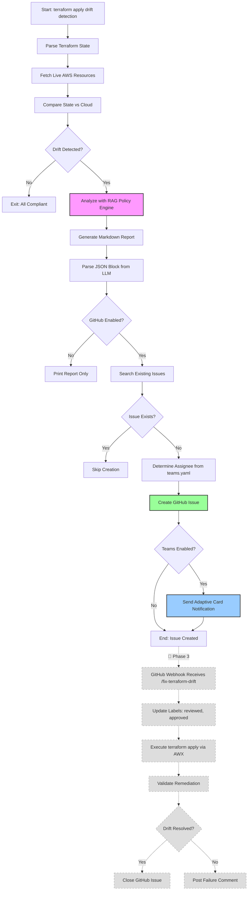

# 05 — Terraform Drift Detector & Explainer

> **Difficulty:** Intermediate-Advanced  
> **Pattern:** ReAct Agent with RAG (Retrieval Augmented Generation)  
> **LangChain Components:** `ChatOllama`, `@tool`, `create_react_agent`, `Chroma`, `OllamaEmbeddings`, `boto3`

An intelligent drift detection agent that identifies discrepancies between Terraform state files and live AWS cloud resources, then explains **why they matter** by analyzing organizational policies using RAG.

---

## Overview

### What Problem Does This Solve?

Manual changes to cloud infrastructure (emergency hotfixes, accidental modifications, testing) create **drift** between Terraform's desired state and reality. This causes:

- **Security risks:** Missing tags → instances lose backup policies, violate compliance
- **Cost overruns:** Instance types manually changed → unexpected AWS bills
- **Audit failures:** Security groups modified → compliance violations (SOC2, HIPAA, PCI)
- **Team confusion:** State file doesn't match reality → deployments fail

### How Does It Work?

1. **Parse Terraform state** (`.tfstate` files) to extract desired resource configurations
2. **Fetch live AWS resources** via boto3 API (EC2, RDS, S3, Security Groups)
3. **Compare state vs. cloud** using deepdiff to identify drift
4. **Analyze with RAG:** Query vector store of organizational policies (YAML files) to explain security/compliance impact
5. **Generate reports:** Structured markdown output with severity classification, policy violations, and remediation commands

**Key Innovation:** RAG ensures all policy violations cite **actual organizational policies** stored in `policies/*.yaml` files, eliminating LLM hallucination.

---

## Setup

### 1. Environment Variables

This project requires AWS credentials. Copy `.env.example` to `.env` and configure:

```powershell
cp .env.example .env
notepad .env  # Add your AWS credentials
```

**Required variables (add to project `.env`):**
```env
# AWS Credentials
AWS_ACCESS_KEY_ID=your_access_key_here
AWS_SECRET_ACCESS_KEY=your_secret_key_here
AWS_DEFAULT_REGION=us-east-1

# Chroma Vector Store
CHROMA_COLLECTION_NAME=terraform_policies
CHROMA_PERSIST_DIR=./vector_store

# GitHub Integration (Optional - Phase 1)
GITHUB_TOKEN=ghp_your_github_personal_access_token_here
GITHUB_OWNER=your_github_username_or_org
GITHUB_REPO=your_infrastructure_repo_name
GITHUB_ISSUE_STRATEGY=per-resource  # Options: per-resource, per-severity, summary
GITHUB_ISSUE_ENABLED=false  # Set to true to enable GitHub issue creation
GITHUB_ISSUE_ASSIGNEE=@infrastructure-team  # Fallback assignee if teams.yaml doesn't match

# Microsoft Teams Notifications (Optional - Phase 2)
TEAMS_WEBHOOK_URL=https://your-tenant.webhook.office.com/webhookb2/your-webhook-url
TEAMS_NOTIFICATION_ENABLED=false  # Set to true to enable Teams notifications
```

**Root `.env` variables (inherited automatically):**
- `OLLAMA_BASE_URL` — Ollama server URL
- `OLLAMA_MODEL` — Default LLM model (e.g., `gpt-oss:20b`)
- `OLLAMA_EMBEDDING_MODEL` — Embedding model (e.g., `nomic-embed-text`)

### 2. AWS IAM Permissions

The agent requires read-only AWS permissions. Attach this IAM policy to your user/role:

```json
{
  "Version": "2012-10-17",
  "Statement": [
    {
      "Effect": "Allow",
      "Action": [
        "ec2:DescribeInstances",
        "ec2:DescribeSecurityGroups",
        "ec2:DescribeTags",
        "rds:DescribeDBInstances",
        "s3:GetBucketTagging",
        "s3:GetBucketVersioning"
      ],
      "Resource": "*"
    }
  ]
}
```

### 3. Install Dependencies

```powershell
# Activate project virtual environment
.venv\Scripts\Activate.ps1

# Dependencies are already installed during scaffold
# To reinstall:
uv pip install -r requirements.txt
```

### 4. Initialize RAG Vector Store

On first run, the agent automatically indexes policy files from `policies/` directory into the Chroma vector store:

```powershell
# Run with --rebuild-vector-store to force reindex
python src/main.py --check --workspace dev --rebuild-vector-store
```

**Policy files included:**
- `policies/tags.yaml` — Tag requirements per environment (prod, staging, dev)
- `policies/compliance.yaml` — Compliance framework mappings (SOC2, HIPAA, PCI)
- `policies/security_groups.yaml` — Ingress/egress rule policies
- `docs/terraform_best_practices.md` — Naming conventions, tagging strategy

**Customizing policies:** Edit YAML files in `policies/` directory and rebuild the vector store to update policy enforcement.

---

## Usage

### Check Mode — Full Workspace Drift Scan

Scans all resources in Terraform state file and generates drift report:

```powershell
python src/main.py --check --workspace prod --state-file terraform.tfstate
```

**Sample output:**
```markdown
================================================================================
## Drift Analysis Report — Production Workspace (prod)
**Scan completed:** 2026-05-23 14:32:15 UTC
**State file:** terraform.tfstate
**Total resources scanned:** 12  |  **Drifted:** 3  |  **Compliant:** 9

### Critical Severity (2 resources)

┌────────────────────────────────────────────────────────────────────────────┐
│  Resource: aws_instance.web-prod-01 (i-0123456789abcdef0)                 │
├────────────────────────────────────────────────────────────────────────────┤
│  Drift Type: Tags Modified                                                 │
│  ├─ Removed tags: ["Environment"]                                          │
│                                                                             │
│  ⚠️ Policy Violation: policies/tags.yaml → production.required_tags[0]    │
│  ├─ Severity: CRITICAL                                                     │
│  ├─ Impact: "Instance not enrolled in automated backup schedule"          │
│  ├─ Compliance Frameworks: SOC2 Section 4.2.1 - Data Retention           │
│                                                                             │
│  🔧 Remediation:                                                           │
│     terraform apply -target=aws_instance.web-prod-01                       │
└────────────────────────────────────────────────────────────────────────────┘

================================================================================
## Remediation Summary

Run the following commands to restore compliance:

```bash
terraform apply -target=aws_instance.web-prod-01
terraform apply -target=aws_security_group.web-sg
```
================================================================================
```

### Remediation Mode — Single Resource Fix Plan

Generates detailed remediation plan for a specific drifted resource:

```powershell
python src/main.py --fix --workspace prod --resource i-0123456789abcdef0
```

**Sample output:**
```markdown
================================================================================
## Remediation Plan — Resource: i-0123456789abcdef0
**Workspace:** prod

### Drift Details
**What Changed:** Environment tag removed

**Policy Violation:** policies/tags.yaml → production.required_tags[0]
**Impact:** Instance not enrolled in automated backup schedule

**Compliance Frameworks Affected:**
- SOC2 Section 4.2.1 - Data Retention
- HIPAA §164.308(a)(7)(ii)(A)

### Remediation Steps
1. Apply Terraform: `terraform apply -target=aws_instance.web-prod-01`
2. Verify tags: `aws ec2 describe-instances --instance-ids i-abc123`
3. Confirm backup enrollment in AWS Backup console
================================================================================
```

### CLI Options

```powershell
# Check mode options
python src/main.py --check \
  --workspace <workspace_name> \
  --state-file <path_to_tfstate> \
  [--rebuild-vector-store] \
  [--vector-store-dir <path>]

# Fix mode options
python src/main.py --fix \
  --workspace <workspace_name> \
  --resource <aws_resource_id> \
  --state-file <path_to_tfstate>
```

| Option | Description | Required |
|---|---|---|
| `--check` | Check mode: full workspace scan | Yes (mutually exclusive with `--fix`) |
| `--fix` | Fix mode: single resource remediation | Yes (mutually exclusive with `--check`) |
| `--workspace` | Terraform workspace name (alphanumeric + `_-`) | Yes |
| `--state-file` | Path to `.tfstate` file (default: `terraform.tfstate`) | No |
| `--resource` | AWS resource ID for fix mode (e.g., `i-abc123`) | Required for `--fix` |
| `--rebuild-vector-store` | Force rebuild of RAG vector store from policies | No |
| `--vector-store-dir` | Vector store directory (default: `./vector_store`) | No |

---

## GitHub Integration & Automated Workflow (Phase 1 & 2)

The agent supports **automated issue tracking** and **Microsoft Teams notifications** to streamline drift remediation workflows. When enabled, drift detection automatically:

1. ✅ Creates GitHub issues with drift details and policy violations
2. ✅ Deduplicates issues (avoids creating duplicates for same resource)
3. ✅ Assigns issues to teams based on resource ownership patterns
4. ✅ Sends adaptive card notifications to Microsoft Teams channels

### End-to-End Workflow Diagram



**Legend:**
- 🟢 **Solid boxes:** Currently implemented (Phase 1 & 2)
- 🟤 **Dashed boxes:** Future phases (Phase 3 & 4) — see [Future Releases](#future-releases) section

### Setup GitHub Integration

#### 1. Create GitHub Personal Access Token

Generate a token with `repo` scope for issue management:

```powershell
# Visit: https://github.com/settings/tokens/new
# Scopes required: repo (full control of private repositories)
# Copy token to .env file
```

#### 2. Configure Environment Variables

Update `.env` with GitHub settings:

```env
GITHUB_TOKEN=ghp_your_token_here
GITHUB_OWNER=vibhatsrivastava  # Your GitHub username or org
GITHUB_REPO=Agentic_AI_Development_Framework  # Repository name
GITHUB_ISSUE_STRATEGY=per-resource  # See strategies below
GITHUB_ISSUE_ENABLED=true  # Enable issue creation
GITHUB_ISSUE_ASSIGNEE=@infrastructure-team  # Fallback assignee
```

**Issue Creation Strategies:**

| Strategy | Behavior | Use Case |
|---|---|---|
| `per-resource` | Creates one issue per drifted resource | Default; best for distributed ownership and detailed tracking |
| `per-severity` | Groups resources by severity level (one issue per CRITICAL/HIGH/MEDIUM/LOW) | Useful for priority-based remediation workflows |
| `summary` | Creates single issue with all drift in a table | Best for daily digest reports or small workspaces |

#### 3. Configure Resource Ownership

Edit `policies/teams.yaml` to define automatic assignee patterns:

```yaml
resource_ownership:
  ec2:
    default_owner: "@infrastructure-team"
    patterns:
      - pattern: "web-.*"
        owner: "@web-team"
      - pattern: "api-.*"
        owner: "@backend-team"
      - pattern: ".*-prod-.*"
        owner: "@production-team"
  
  rds:
    default_owner: "@database-team"
    patterns:
      - pattern: "postgres-.*"
        owner: "@postgres-admin"
  
  s3:
    default_owner: "@storage-team"
    patterns: []
```

**Fallback chain for assignees:**
1. **Pattern match:** Regex match on resource name (e.g., `web-prod-01` → `@web-team`)
2. **Default owner:** Resource type default (e.g., EC2 → `@infrastructure-team`)
3. **Environment variable:** `GITHUB_ISSUE_ASSIGNEE`
4. **None:** Issue created without assignee

### Setup Microsoft Teams Notifications

#### 1. Create Incoming Webhook

Follow [Microsoft's guide](https://docs.microsoft.com/en-us/microsoftteams/platform/webhooks-and-connectors/how-to/add-incoming-webhook) to create a webhook:

```powershell
# Teams Channel → More options (···) → Connectors → Incoming Webhook
# Name: Terraform Drift Alerts
# Copy webhook URL to .env
```

#### 2. Configure Environment Variables

Update `.env` with Teams settings:

```env
TEAMS_WEBHOOK_URL=https://your-tenant.webhook.office.com/webhookb2/your-webhook-url
TEAMS_NOTIFICATION_ENABLED=true
```

### Example: Automated Workflow Execution

```powershell
# Run drift detection with GitHub + Teams integration enabled
python src/main.py --check --workspace production --state-file terraform.tfstate
```

**What happens:**
1. Agent detects 3 drifted resources
2. Searches GitHub for existing issues (deduplication)
3. Creates 3 GitHub issues (per-resource strategy):
   - **Issue #42:** `🚨 Drift: aws_instance.web-prod-01 - Tags Modified (production)` → Assigned to `@web-team`
   - **Issue #43:** `🚨 Drift: aws_db_instance.postgres-main - Instance Type Changed (production)` → Assigned to `@database-team`
   - **Issue #44:** `🚨 Drift: aws_security_group.api-sg - Ingress Rules Modified (production)` → Assigned to `@backend-team`
4. Sends adaptive card to Teams channel with summary:
   - **Total Resources:** 15
   - **Drifted:** 3
   - **Severity Breakdown:** CRITICAL: 1, HIGH: 2
   - **Action Buttons:** Links to GitHub issues

**Sample GitHub Issue:**

```markdown
## Drift Detection Alert

**Workspace:** `production`  
**Resource ID:** `i-0123456789abcdef0`  
**Resource Type:** `aws_instance`  
**Resource Name:** `web-prod-01`  
**Severity:** `CRITICAL`  

### Drift Details
**Type:** Tags Modified

**Changes:**
- removed_tags: `["Environment"]`

### Policy Violations
- **Policy:** `policies/tags.yaml`
  - **Section:** `production.required_tags[0]`
  - **Impact:** Instance not enrolled in automated backup schedule

### Remediation
\```bash
terraform apply -target=aws_instance.web-prod-01
\```

---
*Generated by Terraform Drift Detector*
```

**Sample Teams Notification:**

Teams adaptive card with:
- 🔴 **Red header** (CRITICAL severity)
- **Facts:** Workspace, Severity, Resources, Issue #, Detected Time
- **Action button:** "View Issue on GitHub" → Opens issue #42

---

## Future Releases

### 🚧 Phase 3: Automated Remediation (Not Yet Implemented)

**Goal:** Enable slash command (`/fix-terraform-drift`) on GitHub issues to trigger automated terraform apply via AWX.

**Planned Features:**
- GitHub webhook listener (FastAPI service)
- Slash command parser (`/fix-terraform-drift [approve|reject]`)
- AWX job template execution for terraform apply
- Post-remediation validation (re-run drift detection)
- Auto-close issue on successful remediation

**Architecture:**
```
GitHub Issue Comment → Webhook → FastAPI Service → AWX API → Terraform Apply → Validation → Close Issue
```

**See:** `docs/phase3_automated_remediation.md` (to be created)

### 🚧 Phase 4: Testing & CI/CD (Not Yet Implemented)

**Goal:** Comprehensive test coverage for GitHub/Teams integrations and automated PR-based drift checks.

**Planned Features:**
- Unit tests for `github_tools.py`, `teams_notifications.py`, `teams_parser.py`
- Integration tests for issue creation workflow
- GitHub Actions workflow for PR-based drift detection
- Automated testing of webhook handlers

**See:** `docs/phase4_testing_cicd.md` (to be created)

---

## Project Structure

```
05_terraform_drift_detector/
├── src/
│   ├── main.py                    # CLI entry point + agent builder + GitHub/Teams orchestration
│   ├── rag/
│   │   ├── __init__.py
│   │   └── vector_store.py        # RAG initialization (Chroma + embeddings)
│   ├── tools/
│   │   ├── __init__.py
│   │   ├── terraform_tools.py     # parse_terraform_state tool
│   │   ├── aws_tools.py           # fetch_cloud_resources tool (boto3)
│   │   ├── diff_tools.py          # compare_resources tool (deepdiff)
│   │   ├── policy_tools.py        # analyze_drift_with_policies tool (RAG + LLM)
│   │   └── github_tools.py        # GitHub API tools (create_issue, search_issues, etc.)
│   ├── utils/
│   │   ├── __init__.py
│   │   └── teams_parser.py        # teams.yaml parser for assignee resolution
│   └── integrations/
│       ├── __init__.py
│       └── teams_notifications.py # Microsoft Teams adaptive card sender
├── policies/
│   ├── tags.yaml                  # Tag requirements per environment
│   ├── compliance.yaml            # SOC2/HIPAA/PCI framework mappings
│   ├── security_groups.yaml       # Ingress/egress rule policies
│   └── teams.yaml                 # Resource ownership patterns for GitHub assignees
├── docs/
│   └── terraform_best_practices.md # Best practices documentation
├── vector_store/                  # Chroma vector store (auto-generated)
├── test_infrastructure/           # Standalone Terraform configs for manual testing
│   ├── main.tf                    # EC2 instance for drift testing
│   ├── outputs.tf                 # 7 outputs for validation
│   └── README.md                  # 450+ line testing guide
├── tests/
│   ├── conftest.py                # pytest fixtures (mock boto3, LLM, vector store)
│   ├── test_terraform_tools.py    # Tests for state parsing + redaction
│   ├── test_aws_tools.py          # Tests for AWS API calls (mocked with moto)
│   ├── test_diff_tools.py         # Tests for drift comparison
│   ├── test_policy_tools.py       # Tests for RAG policy analysis
│   ├── test_github_tools.py       # Tests for GitHub API integration (mocked requests)
│   ├── test_teams_notifications.py # Tests for Teams webhook (mocked requests)
│   ├── test_teams_parser.py       # Tests for teams.yaml parser and assignee resolution
│   ├── test_vector_store.py       # Tests for Chroma initialization
│   └── test_main.py               # Integration tests for agent + CLI
├── requirements.txt               # boto3, pyyaml, deepdiff, langchain-chroma, requests
├── .env.example                   # AWS credentials + GitHub + Teams template
└── README.md                      # This file
```
│   ├── test_vector_store.py       # Tests for Chroma initialization
│   └── test_main.py               # Integration tests for agent + CLI
├── requirements.txt               # boto3, pyyaml, deepdiff, langchain-chroma
├── .env.example                   # AWS credentials template
└── README.md                      # This file
```

---

## Testing

All code maintains >= 75% test coverage (enforced via `pytest.ini`).

### Run Tests

```powershell
# Run all tests with coverage report
pytest --cov --cov-report=term-missing

# Run specific test module
pytest tests/test_terraform_tools.py -v

# Verify >= 75% coverage threshold
pytest --cov --cov-fail-under=75
```

### Test Strategy

- **Unit tests:** All tools tested in isolation with mocked dependencies
- **Mocking strategy:** 
  - boto3 calls mocked with `unittest.mock.MagicMock`
  - LLM calls mocked via `conftest.py` fixtures
  - Vector store mocked to return predefined policy documents
- **Integration tests:** End-to-end tests in `test_main.py` mock agent invocation but test CLI argument parsing and validation

**No real AWS API calls in tests** — all boto3 clients are mocked.

---

## Manual Integration Testing

To test the agent end-to-end with real AWS resources, use the provided test infrastructure:

### Quick Start

```powershell
# 1. Provision test EC2 instance with tags
cd test_infrastructure
terraform init
terraform apply

# 2. Manually remove a tag in AWS Console to simulate drift

# 3. Run the agent to detect drift
cd ..
python src/main.py --state-file test_infrastructure/terraform.tfstate

# 4. Clean up resources
cd test_infrastructure
terraform destroy
```

### Detailed Testing Guide

See [test_infrastructure/README.md](test_infrastructure/README.md) for:
- **Prerequisites:** AWS CLI setup, Terraform installation, IAM permissions
- **Cost information:** Free Tier eligibility, estimated costs
- **Step-by-step workflow:** EC2 provisioning → manual drift simulation → agent execution → cleanup
- **Expected results:** Sample agent output with drift detection and policy violations
- **Troubleshooting:** Common issues and solutions

**Why use test infrastructure?**
- ✅ **Isolated testing:** Self-contained AWS resources that won't affect production
- ✅ **Reproducible drift:** Controlled environment to simulate specific drift scenarios
- ✅ **Cost-effective:** Uses Free Tier eligible resources (t2.micro EC2 instance)
- ✅ **Independent:** Can be deleted after testing without breaking the agent

---

## Security Considerations

1. **Terraform state secrets:** Sensitive attributes (passwords, API keys) are redacted before passing to LLM. State files marked with `"sensitive": true"` have values replaced with `[REDACTED]`.

2. **AWS credentials:** Never logged or printed. Read exclusively via `require_env()` from `common/utils.py`.

3. **Prompt injection:** Resource names/tags from user-controlled sources are wrapped in XML delimiters (`<drift_details>...</drift_details>`) to prevent LLM instruction injection.

4. **Policy file integrity:** Policy files must be version-controlled (Git) and read-only to the agent.

5. **Rate limiting:** AWS API calls throttled to 2 req/sec using `common/rate_limiter.py` to stay under AWS limits.

---

## Advanced Usage

### Custom Policy Files

Add new policy files to `policies/` directory and rebuild vector store:

```powershell
# Create custom policy
notepad policies/cost_optimization.yaml

# Rebuild vector store to index new policy
python src/main.py --check --workspace dev --rebuild-vector-store
```

**Policy file format (YAML):**
```yaml
environments:
  production:
    required_tags:
      - name: CostCenter
        value: "^dept-.*"
        violations:
          missing: "Cannot allocate costs to department budget"
        compliance_frameworks:
          - framework: Internal
            section: "Cost Allocation Policy 2.3"
```

### Extending to Other Cloud Providers

To add Azure/GCP support:

1. Create new tool files: `src/tools/azure_tools.py`, `src/tools/gcp_tools.py`
2. Implement resource fetchers using azure-mgmt-resource SDK or google-cloud-resource-manager
3. Update `src/tools/__init__.py` to export new tools
4. Add provider-specific policies to `policies/` directory

---

## Troubleshooting

### Vector Store Initialization Fails

**Error:** `FileNotFoundError: Policies directory not found`

**Solution:** Ensure `policies/` directory exists and contains at least one `.yaml` file.

### AWS API Throttling

**Error:** `AWS API rate limit exceeded`

**Solution:** Reduce number of resources in state file or increase rate limit in `src/tools/aws_tools.py` (line 11: `TokenBucketRateLimiter(tokens_per_second=2)`).

### LLM Hallucinating Policy Violations

**Issue:** Agent reports policy violations not present in `policies/` files.

**Solution:** 
1. Verify vector store contains correct policies: `python src/main.py --check --workspace dev --rebuild-vector-store`
2. Check `SYSTEM_PROMPT` in `src/main.py` includes grounding instructions
3. Reduce RAG retrieval `k` parameter in `src/main.py` (line 88: `get_retriever(vector_store, k=5)`)

---

## Future Enhancements

- [ ] Support for Terraform Cloud API (remote state)
- [ ] Azure and GCP resource drift detection
- [x] ~~GitHub issue tracking integration~~ ✅ **Implemented (Phase 1)**
- [x] ~~Microsoft Teams notifications~~ ✅ **Implemented (Phase 2)**
- [ ] Automated remediation via GitHub slash commands (🚧 Phase 3 - see [Future Releases](#future-releases))
- [ ] GitHub Actions CI/CD integration (🚧 Phase 4 - see [Future Releases](#future-releases))
- [ ] Web UI for drift visualization (Streamlit)
- [ ] Historical drift trend analysis
- [ ] Slack integration (alternative to Teams)

---

## License

This project is part of the Agentic AI Development Framework. See repository root LICENSE file.

## Resources

- [Repository Docs](../../docs/getting_started.md)
- [LangChain Documentation](https://docs.langchain.com/)
- [LangGraph Documentation](https://langchain-ai.github.io/langgraph/)
- [Ollama Documentation](https://ollama.com/)

---

## License

See repository LICENSE file.
